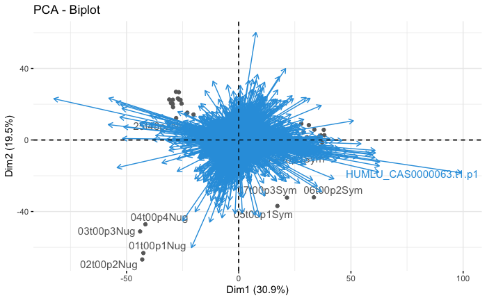

For RNAseq pipeline, please refer to [here](RNAseq_pipeline.md). 

# First, let's look at Nugget vs. Symphony

```{r load packages, message=FALSE, warning=FALSE, include=FALSE}
#Remember you can install packages from cran using install.packages("packagename")
#For Bioc packages, it's a little different
#BiocManager::install('apeglm')

library(PCAtools)
library(genefilter)
library(pheatmap)
library(RColorBrewer)
library(DESeq2)
library(tximportData)
library(tximport)
library(dplyr)
library(ggplot2)
library(hexbin)
library(readr)
library(adegenet)
library(readxl)
library(janitor)
library(gplots)
library(factoextra)
library(cowplot)
library(apeglm)
library(ggpubr)
```


# Loading data
```r 

#load count data into R. We have to skip annotation columns for now since this needs to be a matrix.
countData_NugSym <- read_excel("Desktop/NEWVERSION_dovetailAssemblyFullNonRepeatAssociatedGeneList.xlsx", 
                        col_types = c("text", "skip", "skip", "numeric", "numeric", "numeric", "numeric", "numeric", "numeric", "numeric", "skip", "numeric", "numeric", "numeric", "numeric", "numeric", "numeric", "numeric", "numeric", "numeric", "numeric", "numeric", "numeric", "numeric", "numeric", "numeric", "numeric", "numeric", "numeric", "numeric", "numeric", "numeric", "numeric", "numeric", "numeric", "numeric", "numeric", "numeric", "numeric", "numeric", "skip", "numeric"))

#View(countData_NugSym)
#Store GeneID info because the matrix doesnt like it. 
GeneID <- countData_NugSym$GeneID

#convert counts to matrix and subtract geneID column. 
countData2_NugSym_mtx <- as.matrix(countData_NugSym[ , -1])

#check work if you want
#View(countData2_NugSym)

#add gene IDs back... I knowm it's ridiculous. 
row.names(countData2_NugSym_mtx) <- GeneID  

```

# Some data visualization 
* Check raw reads for trends
* First pre-processing visuals

```r
row.names(countData_NugSym) <- GeneID   
countData_NugSym = data.frame(countData_NugSym)
countData_NugSym <- countData_NugSym[,-1]
#View(countData_NugSym)

#Quick view of raw reads
par(mar=c(8,4,4,1)+0.1)
barplot(colSums(countData_NugSym)/1e6, las =3)

```


```r
#clearly need to transform
hist(countData_NugSym$X01t00p1Nug, br=100)

```


```r
#log transformation seems to normalize it pretty well 
logcountdata = log2(1+countData_NugSym)
hist(logcountdata$X01t00p1Nug, br=100)
```


```r
#pretty strongly correlated within nugget uninoculated treatments
plot(logcountdata[,1], logcountdata[,2])
```


```r
#A lot more differences between treatments (less correlation)
plot(logcountdata[,1], logcountdata[,12])

```


# DESeq prep

```r

#will need this later
Samples <- c(" 01t00p1Nug"," 02t00p2Nug"," 03t00p3Nug"," 04t00p4Nug", " 05t00p1Sym", " 06t00p2Sym","07t00p3Sym","09t12p1Nug","10t12p2Nug","11t12p3Nug","12t12p1Sym","13t12p2Sym","14t12p3Sym","15t12p4Sym","16t24p1Nug","17t24p2Nug","18t24p3Nug","19t24p4Nug","20t24p1Sym","21t24p2Sym","22t24p3Sym","23t24p4Sym","24t48p1Nug","25t48p2Nug","26t48p3Nug","27t48p4Nug","28t48p1Sym","29t48p2Sym","30t48p3Sym","31t48p4Sym","32t72p1Nug","33t72p2Nug","34t72p3Nug","35t72p4Nug","36t72p1Sym","37t72p2Sym","39t72p4Sym") 

#set up experiment metadata
genotype=as.factor(c(rep("Nugget", 4), rep("Symphony",3), rep("Nugget", 3), rep("Symphony", 4), rep("Nugget", 4), rep("Symphony", 4), rep("Nugget", 4), rep("Symphony", 4), rep("Nugget", 4), rep("Symphony", 3)))
time=as.factor(c(rep("0hr", 7), rep("12hr", 7), rep("24hr", 8), rep("48hr", 8), rep("72hr", 7)))
colData = data.frame(col.names = c(" 01t00p1Nug"," 02t00p2Nug"," 03t00p3Nug"," 04t00p4Nug", " 05t00p1Sym", " 06t00p2Sym","07t00p3Sym","09t12p1Nug","10t12p2Nug","11t12p3Nug","12t12p1Sym","13t12p2Sym","14t12p3Sym","15t12p4Sym","16t24p1Nug","17t24p2Nug","18t24p3Nug","19t24p4Nug","20t24p1Sym","21t24p2Sym","22t24p3Sym","23t24p4Sym","24t48p1Nug","25t48p2Nug","26t48p3Nug","27t48p4Nug","28t48p1Sym","29t48p2Sym","30t48p3Sym","31t48p4Sym","32t72p1Nug","33t72p2Nug","34t72p3Nug","35t72p4Nug","36t72p1Sym","37t72p2Sym","39t72p4Sym"), genotype, time)

#create DESEQ2 object genotype and condition plus their interaction
dds <- DESeqDataSetFromMatrix(countData = countData2_NugSym_mtx, colData = colData, ~ genotype + time + genotype:time)

#delete rows with less than 10 reads
dds <-dds[ rowSums(counts(dds)) > 10, ]

```
# Running DESeq
This DESeq is making all possible comparisons within our data; we can choose to look at all comparisons at once, or we can make a subset of them by defining a contrast within our results. 


```r 

#run DESeq... this performs the median of ratios normalization method
dds <- DESeq(dds)

#check out the normalization
sizeFactors(dds)

## Total number of raw counts per sample
colSums(counts(dds))

## Total number of normalized counts per sample
colSums(counts(dds, normalized=T))

#extract normalized counts
normalized_counts <- counts(dds, normalized=TRUE)
#View(normalized_counts)

# write to table
write.table(normalized_counts, file="normalized_counts.txt", sep="\t", quote=F, col.names=NA)

#NOTE: DESeq2 doesn’t actually use normalized counts, rather it uses the raw counts and models the normalization inside the Generalized Linear Model (GLM). These normalized counts will be useful for downstream visualization of results, but cannot be used as input to DESeq2 or any other tools that perform differential expression analysis which use the negative binomial model.

# Plot dispersion estimates
plotDispEsts(dds)

```


# Examining dds results (as dds object)

If we choose to look at just genotypes, this is what that comparison would look like:


```r

#lets just compare nugget and symphony
contrast_genotypes <- c("genotype", "Nugget", "Symphony")
res005_genotypes <- results(dds, contrast=contrast_genotypes, alpha=0.0025)

#lets look at time differences (this unfortunately clumps in nugget and symphony)
contrast_time <- c("time", "0hr", "72hr")
res005_time <- results(dds, contrast=contrast_time, alpha=0.0025)
#View(res005_time)


#visulize sig points
plotMA(res005_genotypes, ylim=c(-2,2)) 
plotMA(res005_time, ylim=c(-2,2))
 
```
**Genotypes**


**Time**


# Examining dds results (as df)

```r 
#order by pvalue, genotype
resOrdered <- as.data.frame(res005_genotypes)

#for time
resTime <- as.data.frame(res005_time)

#import molecular function df
goTerms_molecular <- read_tsv('/Users/michelewiseman/Desktop/goTerms_molecularFunction(1).tsv', col_names=FALSE)
names(goTerms_molecular) <- c('geneID', 'UNIProt_ID', 'GO ID', 'Description', 'Key terms')

#import kegg pathway mapp
kegg_pathway <- read_csv('/Users/michelewiseman/Desktop/kegg_pathway_map.csv', col_names=TRUE)

#merge go terms to results df - genotype
resOrdered <- tibble::rownames_to_column(resOrdered, "geneID")
resOrdered<-merge(resOrdered, goTerms_molecular, by.a="geneID", by.b="geneID", all.x=TRUE, all.y=FALSE)
resOrdered<-merge(resOrdered, kegg_pathway, by.a="UNIProt_ID", by.b="UNIProt_ID", all.x=TRUE, all.y=FALSE)

#merge go terms to results df - time
resTime <- tibble::rownames_to_column(resTime, "geneID")
resTime<-merge(resTime, goTerms_molecular, by.a="geneID", by.b="geneID", all.x=TRUE, all.y=FALSE)
resTime<-merge(resTime, kegg_pathway, by.a="UNIProt_ID", by.b="UNIProt_ID", all.x=TRUE, all.y=FALSE)

#sort by p-value and set cut-off to 0.05
resOrdered <- resOrdered[order(resOrdered$pvalue),]
resOrdered_pval_cutoff <- resOrdered %>%
  filter(padj < 0.05)

#subsample only results with less than 0.01 p-value and greater than 1-fold change or less than -1 fold change
resSig <- resOrdered_pval_cutoff[ resOrdered_pval_cutoff$padj < 0.01 & (resOrdered_pval_cutoff$log2FoldChange >1| resOrdered_pval_cutoff$log2FoldChange < -1), ]

#remove any rows that lack UNIProt_ID or Kegg_accession
resSig<-resSig %>%
    filter_at(vars(UNIProt_ID, Kegg_accession), all_vars(!is.na(.)))

#write to csv
write.csv(resOrdered_pval_cutoff, "Nugget_vs_Sym_results_with_Kegg_path_and_goTermsMolecular.csv")

```
[Downregulated genes (LFC =< 1)](https://biit.cs.ut.ee/gplink/l/aAlxOCt1Tx)

[Upregulated genes (LFC >= 1)](https://biit.cs.ut.ee/gplink/l/i2Vgb-CyT6)


# Transformation of counts

```r 
#transform data
vst <- vst(dds, blind=FALSE)
rld <- rlog(dds, blind=FALSE)

#log transformed matrix
distsRL <- dist(t(assay(rld)))
mat <- as.matrix(distsRL)

#vst matrix
dist_vst <- dist(t(assay(vst)))
mat_vst <- as.matrix(dist_vst)

#rename row names with descriptive names
rownames(mat) <- colnames(mat) <- with(colData(dds), paste(genotype, time, sep=" : "))
rownames(mat_vst) <- colnames(mat_vst) <- with(colData(dds), paste(genotype, time, sep=" : "))

```
# Counts plot

```r
#visualing the normalized gene counts for each treatment
#condition
library("ggbeeswarm")
geneCounts <- plotCounts(dds, gene = topGene, intgroup = c("condition","genotype"),
                         returnData = TRUE)
ggplot(geneCounts, aes(x = dex, y = count, color = cell)) +
  scale_y_log10() +  geom_beeswarm(cex = 3)
  
#time
geneCounts2 <- plotCounts(dds, gene = topGene, intgroup = c("time","genotype"),
                         returnData = TRUE)
ggplot(geneCounts2, aes(x = dex, y = count, color = cell)) +
  scale_y_log10() +  geom_beeswarm(cex = 3)
```
**Condition**


**Time**


# Heat maps

```r
rv <- rowVars(assay(rld))
select <- order(rv, decreasing=T)[seq_len(min(500,length(rv)))]
pc <- prcomp(t(assay(vsd)[select,]))

#just examining genotype for now
condition <- genotype
scores <- data.frame(pc$x, condition)

#define heat map colors
hmcol <- colorRampPalette(brewer.pal(9, "GnBu"))(100)

#first way to visualize head map of log transformed data
heatmap.2(mat, trace = "none", col = rev(hmcol), margin = c(13,13))

#do we see a difference with the vst-transformed data?
heatmap.2(mat_vst, trace = "none", col = rev(hmcol), margin = c(13,13))
```
It doesn't look like there's a substantial difference between the log-transformation and variability stabilizing transformation (vst) methods; however, `R` will tell you that `vst` is faster when you have a larger dataset. 


We can also use `pheatmap` to quickly make a heatmap of our data. 
```r
#summarize r-transformed data into a matrix
rld_mat <- assay(rld)

#principle comp
pca <- prcomp(t(mat))

#correlation
cor<-cor(mat)

#heat map of log-transformed data
pheatmap(cor, border_color=NA, fontsize = 10, 
  		fontsize_row = 6, height=20)
```


To make a heatmap visualizing the amount by which the top 10 genes deviate the most in a specific sample from the gene's average across all samples
```r
topVarGenes <- head(order(rowVars(assay(vst)), decreasing = TRUE), 10)

mat  <- assay(vst)[ topVarGenes, ]
mat  <- mat - rowMeans(mat)
anno <- as.data.frame(colData(vst)[, c("genotype","condition")])
pheatmap(mat, annotation_col = anno)

```


To make a heatmap that will find 10 genes that react in a condition-specific manner over time, compared to a set of baseline samples
```r
#If not already loaded 
library("fission")

ddsTC <- DESeqDataSet(dds, ~ genotype + time + genotype:time)

#Run DEseq again
ddsTC <- DESeq(ddsTC, test="LRT", reduced = ~ genotype + time)
resTC <- results(ddsTC)
resTC$symbol <- mcols(ddsTC)$symbol
head(resTC[order(resTC$padj),], 4)

#View 
resultsNames(ddsTC)

#Extract a matrix of the log2 fold changes using the coef function. these are the maximum likelihood estimates (MLE).
betas <- coef(ddsTC)
colnames(betas)

#Plot the log2fold changes
topGenes <- head(order(resTC$padj),10)
mat <- betas[topGenes, -c(1,2)]
thr <- 3 
mat[mat < -thr] <- -thr
mat[mat > thr] <- thr
pheatmap(mat, breaks=seq(from=-thr, to=thr, length=101),
         cluster_col=FALSE)
```


I frankly prefer pheatmap, but both are clear about communicating the differences in gene expression between genotypes. 

# PCA Plots

A PCA plot shows clusters of samples based on their similarity; the closer the points, the more similar their gene expression profiles are.

```r
#Make a new df that binds metadata and PCA values
df <- cbind(colData, pca$x)

#fancy PCA by individuals
fviz_pca_ind(pca,
             col.ind = "cos2", # Color by the quality of representation
             gradient.cols = c("#00AFBB", "#E7B800", "#FC4E07"),
             repel = TRUE     # Avoid text overlapping
             )
             
```
It looks like our samples are grouping together strongly by genotype and either time 0 or non-time 0.


Let's see if we can figure out what genes are contributing to the clustering. The longer the arrow, the larger the effect. 

```r
#fancy PCA by variables
fviz_pca_var(pca,
             col.var = "contrib", # Color by contributions to the PC
             gradient.cols = c("#00AFBB", "#E7B800", "#FC4E07"),
             repel = TRUE     # Avoid text overlapping
             )
```
Unfortunately, this plot isn't super informative because we just have too many differentially expressed genes.


```r
#biplot
fviz_pca_biplot(pca, repel = TRUE,
                col.var = "#2E9FDF", # Variables color
                col.ind = "#696969"  # Individuals color
                )
```
Once again, the biplot is a bit too busy. 




```r
#grouping by time
groups <- as.factor(time)

#individual pca
fviz_pca_ind(pca,
             col.ind = groups, # color by groups
             addEllipses = TRUE, # Concentration ellipses
             ellipse.type = "confidence",
             legend.title = "Groups",
             repel = TRUE
             )
             
#grouping by genotype
groups <- genotype

fviz_pca_ind(pca,
             col.ind = groups, # color by groups
             addEllipses = TRUE, # Concentration ellipses
             ellipse.type = "confidence",
             legend.title = "Groups",
             repel = TRUE
             )
```


We can see that, regardless of genotype, the samples group together by time: either time 0 or not time 0. 


Because the difference in gene expression is so large when examining time, it seems our genotype PCA doesn't capture all of the samples in each respective genotype. In this case, it might be better to just look at differences between genotypes at a certain time grouping (either time zero or not time zero). 

# Scree plot

A scree plot is a graphical tool used in the selection of the number of relevant components or factors to be considered in a principal components analysis or a factor analysis. The

```r
#scree plot
fviz_eig(pca) 

```


```r

#showing p-value across all genes
hist(res005_genotypes$padj, breaks=20, col="grey50", border="white")

#showing p-value after subsampling
hist(resSig$padj, breaks=20, col="grey50", border="white")

#looking at p-values were mean count is greater than 10
hist(res005_genotypes$padj[res005_genotypes$baseMean > 10], breaks=20, col="grey50", border="white")
hist(resSig$padj[resSig$baseMean > 10], breaks=20, col="grey50", border="white")

topGene <- resOrdered$UNIProt_ID[which.min(resOrdered$padj)]

```

# Venn diagram

```{r}
results.interaction.symvnug <- results(dds, 
                                  name="genotype_Symphony_vs_Nugget",
                                  alpha=0.05)

#convert to df
results.interaction.symvnug<-as.data.frame(results.interaction.symvnug)

#make row names a column named geneID
results.interaction.symvnug <- tibble::rownames_to_column(results.interaction.symvnug, "geneID")

#join with goterms
results.interaction.symvnug<-  results.interaction.symvnug %>%
  left_join(goTerms_molecular, "geneID")
  
  #View(results.interaction.symvnug)

results.interaction.0v72 <- results(dds, 
                                  name="time_72hr_vs_0hr",
                                  alpha=0.05)

#repeat as above, but more efficiently.
results.interaction.0v72 <-as.data.frame(results.interaction.0v72) %>%
  as_tibble(results.interaction.0v72, rownames = "geneID") %>%
  left_join(goTerms_molecular, "geneID")

vennDat <- tibble(geneID=rownames(results.interaction.0v72)) %>% 
  mutate(UR_Genotype = results.interaction.symvnug$padj < 0.05 & !is.na(results.interaction.symvnug$padj) & results.interaction.symvnug$log2FoldChange > 0) %>% 
  mutate(DR_Genotype = results.interaction.symvnug$padj < 0.05 & !is.na(results.interaction.symvnug$padj) & results.interaction.symvnug$log2FoldChange < 0) %>%
  mutate(UR_Time = results.interaction.0v72$padj < 0.05 & !is.na(results.interaction.0v72$padj) & results.interaction.0v72$log2FoldChange > 0) %>%
  mutate(DR_Time = results.interaction.0v72$padj < 0.05 & !is.na(results.interaction.0v72$padj) & results.interaction.0v72$log2FoldChange < 0) 

ggvenn(vennDat, set_name_size = 3)
```


It looks like we see the most differences when looking at differences in time (specifically time 0 and time 72), regardless of genotype. This agrees with the PCA plots we looked at above.

Let's simplify our DESeq contrasts this time and instead group all timepoints after 0 as inoculated and all 0 time points uninoculated; admittedly, this gives us an unbalanced design, but, based on the PCA groupings, it seems there are much larger differences between time point 0 and all other time points than any other comparison. 

Continue [here](DESeq-Uninoc_Vs_Inoc.md). 
