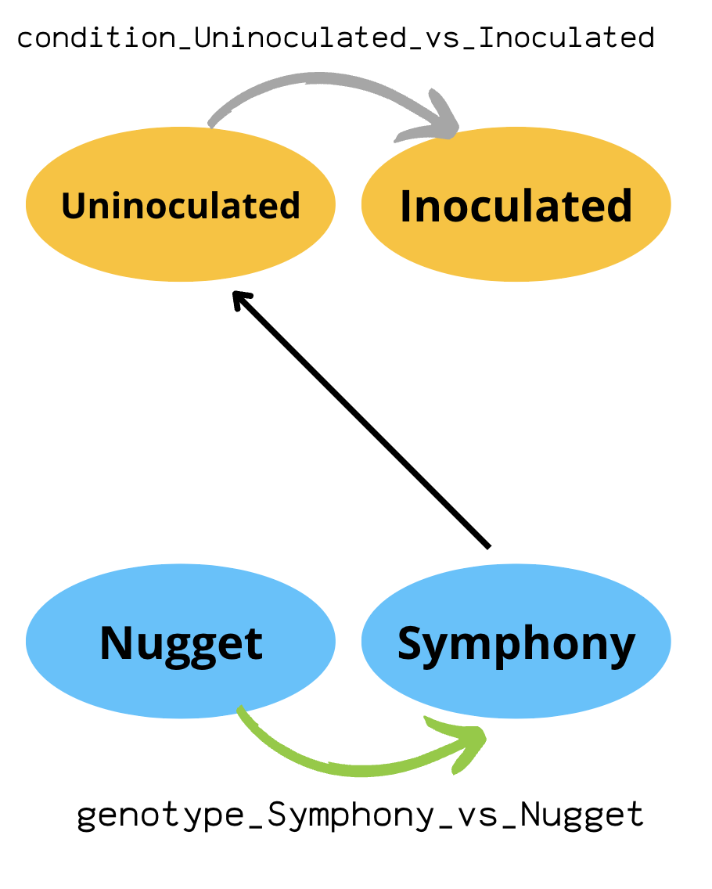
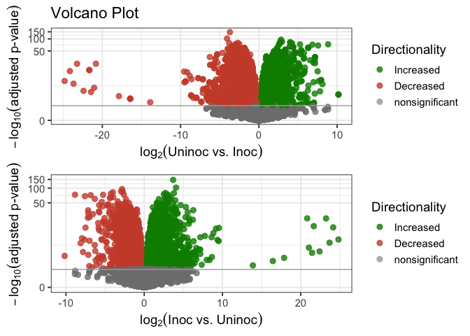
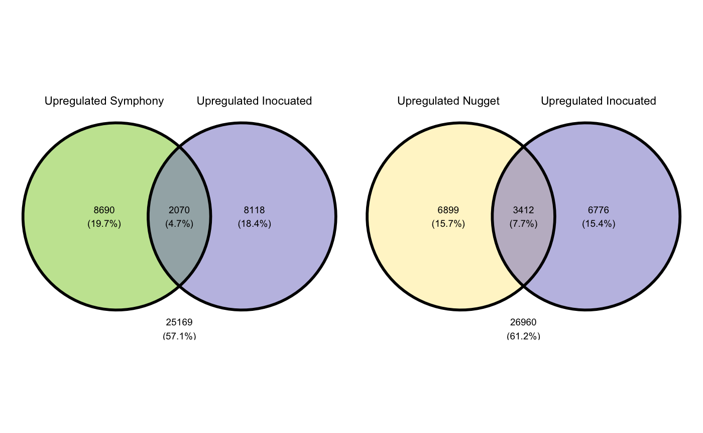

Continued from [Nugget vs. Symphony](DESeq-Nugget_vs_Sym.md). 

# Unioculated plants vs. Inoculated plants. 



Since the time points seem to cluster closely, it might be more informative to look just at uninoculated/inoculated (it also makes for much simpler comparisons as opposed to our previous [comparisons](images/allway.png)). So, we made a new dds object to examine just that. 


``` r
library(heatmap3)
library(topGO)
library(AnnotationDbi)
library(org.Hs.eg.db)
library(genefilter)
library(pheatmap)
library(RColorBrewer)
library(DESeq2)
library(tximportData)
library(tximport)
library(hexbin)
library(readr)
library(adegenet)
library(readxl)
library(janitor)
library(gplots)
library(factoextra)
library(cowplot)
library(apeglm)
library(tidyverse)
library(ggpubr)
library(ggvenn)
library(ggVennDiagram)
library(cowplot)
library(kableExtra)
library(gage)
```

Since the time points seem to cluster closely, it might be more informative to look just at uninoculated/inoculated. So, I made a new dds object to examine just that.

``` r
#load count data into R. We have to skipa annotation columns for now since this needs to be a matrix.
countData_NugSym <- read_excel("Desktop/NEWVERSION_dovetailAssemblyFullNonRepeatAssociatedGeneList.xlsx", 
                        col_types = c("text", "skip", "skip", "numeric", "numeric", "numeric", "numeric", "numeric", "numeric", "numeric", "skip", "numeric", "numeric", "numeric", "numeric", "numeric", "numeric", "numeric", "numeric", "numeric", "numeric", "numeric", "numeric", "numeric", "numeric", "numeric", "numeric", "numeric", "numeric", "numeric", "numeric", "numeric", "numeric", "numeric", "numeric", "numeric", "numeric", "numeric", "numeric", "numeric", "skip", "numeric"))

head(countData_NugSym)
```

    ## # A tibble: 6 × 38
    ##   GeneID        `01t00p1Nug` `02t00p2Nug` `03t00p3Nug` `04t00p4Nug` `05t00p1Sym`
    ##   <chr>                <dbl>        <dbl>        <dbl>        <dbl>        <dbl>
    ## 1 HUMLU_CAS000…           73           75           39           55           88
    ## 2 HUMLU_CAS000…            0            0            0            0            0
    ## 3 HUMLU_CAS000…           11            6            4            2           50
    ## 4 HUMLU_CAS000…            0            0            0            0            0
    ## 5 HUMLU_CAS000…           16           17           11            0          224
    ## 6 HUMLU_CAS000…           60           95           58           61          195
    ## # … with 32 more variables: `06t00p2Sym` <dbl>, `07t00p3Sym` <dbl>,
    ## #   `09t12p1Nug` <dbl>, `10t12p2Nug` <dbl>, `11t12p3Nug` <dbl>,
    ## #   `12t12p1Sym` <dbl>, `13t12p2Sym` <dbl>, `14t12p3Sym` <dbl>,
    ## #   `15t12p4Sym` <dbl>, `16t24p1Nug` <dbl>, `17t24p2Nug` <dbl>,
    ## #   `18t24p3Nug` <dbl>, `19t24p4Nug` <dbl>, `20t24p1Sym` <dbl>,
    ## #   `21t24p2Sym` <dbl>, `22t24p3Sym` <dbl>, `23t24p4Sym` <dbl>,
    ## #   `24t48p1Nug` <dbl>, `25t48p2Nug` <dbl>, `26t48p3Nug` <dbl>, …

``` r
#store GeneID info because the matrix doesnt like it. 
GeneID <- countData_NugSym$GeneID

#convert counts to matrix and subtract geneID column. 
countData2_NugSym_mtx <- as.matrix(countData_NugSym[ , -1])

#add gene IDs back 
row.names(countData2_NugSym_mtx) <- GeneID  
```

``` r
#Change design to inoc/no inoc
#need to set up meta data for DESeq2
condition = as.factor(c(rep("Uninoculated", 7), rep("Inoculated", 30))) 

genotype=as.factor(c(rep("Nugget", 4), rep("Symphony",3), rep("Nugget", 3), rep("Symphony", 4), rep("Nugget", 4), rep("Symphony", 4), rep("Nugget", 4), rep("Symphony", 4), rep("Nugget", 4), rep("Symphony", 3)))

colData = data.frame(col.names = c("01t00p1Nug","02t00p2Nug","03t00p3Nug","04t00p4Nug", "05t00p1Sym", "06t00p2Sym","07t00p3Sym","09t12p1Nug","10t12p2Nug","11t12p3Nug","12t12p1Sym","13t12p2Sym","14t12p3Sym","15t12p4Sym","16t24p1Nug","17t24p2Nug","18t24p3Nug","19t24p4Nug","20t24p1Sym","21t24p2Sym","22t24p3Sym","23t24p4Sym","24t48p1Nug","25t48p2Nug","26t48p3Nug","27t48p4Nug","28t48p1Sym","29t48p2Sym","30t48p3Sym","31t48p4Sym","32t72p1Nug","33t72p2Nug","34t72p3Nug","35t72p4Nug","36t72p1Sym","37t72p2Sym","39t72p4Sym"), genotype, condition) #condition

#create DESEQ2 object genotype and condition plus their interaction
dds <- DESeqDataSetFromMatrix(countData = countData2_NugSym_mtx, colData = colData, ~ genotype + condition + genotype:condition)

#delete rows with less than 10 reads
dds <-dds[ rowSums(counts(dds)) > 10, ]
```

# Annotations
``` r
goTerms_biological <- read_tsv('/Users/michelewiseman/Desktop/goTerms_biologicalProcesses(1).tsv', col_names=FALSE)
goTerms_cellular <- read_tsv('/Users/michelewiseman/Desktop/goTerms_cellularComponents(1).tsv', col_names=FALSE)
goTerms_molecular <- read_tsv('/Users/michelewiseman/Desktop/goTerms_molecularFunction(1).tsv', col_names=FALSE)
kegg_pathway <- read_csv('/Users/michelewiseman/Desktop/kegg_pathway_map.csv', col_names=TRUE)

names(goTerms_biological) <- c('geneID', 'UNIProt_ID', 'GO ID', 'Description', 'Key terms')
names(goTerms_cellular) <- c('geneID', 'UNIProt_ID', 'GO ID', 'Description', 'Key terms')
names(goTerms_molecular) <- c('geneID', 'UNIProt_ID', 'GO ID', 'Description', 'Key terms')
```

## Back to DESeq

``` r
#run DESeq... this performs the median of ratios normalization method
dds <- DESeq(dds)

#check out the normalization
sizeFactors(dds)
```

    ## 01t00p1Nug 02t00p2Nug 03t00p3Nug 04t00p4Nug 05t00p1Sym 06t00p2Sym 07t00p3Sym 
    ##  1.0194419  0.9974977  0.9820269  1.0137816  1.0910307  0.9247626  0.7977107 
    ## 09t12p1Nug 10t12p2Nug 11t12p3Nug 12t12p1Sym 13t12p2Sym 14t12p3Sym 15t12p4Sym 
    ##  0.9955163  1.0538799  0.9496179  0.9762394  0.8839757  1.1450973  1.0721863 
    ## 16t24p1Nug 17t24p2Nug 18t24p3Nug 19t24p4Nug 20t24p1Sym 21t24p2Sym 22t24p3Sym 
    ##  1.1511800  0.8310120  0.8167142  0.8387301  0.8000432  1.2975590  0.9147350 
    ## 23t24p4Sym 24t48p1Nug 25t48p2Nug 26t48p3Nug 27t48p4Nug 28t48p1Sym 29t48p2Sym 
    ##  0.9600909  0.7875961  1.3919375  1.5464050  1.0037243  0.8710435  1.0924666 
    ## 30t48p3Sym 31t48p4Sym 32t72p1Nug 33t72p2Nug 34t72p3Nug 35t72p4Nug 36t72p1Sym 
    ##  1.3691429  1.1493764  0.7934382  1.3281493  1.1829425  0.9165492  1.0299351 
    ## 37t72p2Sym 39t72p4Sym 
    ##  0.9322691  0.8353387

``` r
## Total number of raw counts per sample
colSums(counts(dds))
```

    ## 01t00p1Nug 02t00p2Nug 03t00p3Nug 04t00p4Nug 05t00p1Sym 06t00p2Sym 07t00p3Sym 
    ##   26475616   26334429   23750298   27022754   26648995   25658324   18189054 
    ## 09t12p1Nug 10t12p2Nug 11t12p3Nug 12t12p1Sym 13t12p2Sym 14t12p3Sym 15t12p4Sym 
    ##   23910720   24116256   20996781   22686909   20713989   25875047   25073647 
    ## 16t24p1Nug 17t24p2Nug 18t24p3Nug 19t24p4Nug 20t24p1Sym 21t24p2Sym 22t24p3Sym 
    ##   29328243   20077101   20036646   22030043   19049599   30495058   21230058 
    ## 23t24p4Sym 24t48p1Nug 25t48p2Nug 26t48p3Nug 27t48p4Nug 28t48p1Sym 29t48p2Sym 
    ##   22150870   20465998   34598510   39162778   24321470   20949964   27424229 
    ## 30t48p3Sym 31t48p4Sym 32t72p1Nug 33t72p2Nug 34t72p3Nug 35t72p4Nug 36t72p1Sym 
    ##   33174185   27683924   19070924   29888360   28279299   22344355   24832221 
    ## 37t72p2Sym 39t72p4Sym 
    ##   24543275   20926082

``` r
## Total number of normalized counts per sample
colSums(counts(dds, normalized=T))
```

    ## 01t00p1Nug 02t00p2Nug 03t00p3Nug 04t00p4Nug 05t00p1Sym 06t00p2Sym 07t00p3Sym 
    ##   25970695   26400491   24184978   26655401   24425522   27745851   22801568 
    ## 09t12p1Nug 10t12p2Nug 11t12p3Nug 12t12p1Sym 13t12p2Sym 14t12p3Sym 15t12p4Sym 
    ##   24018412   22883307   22110768   23239085   23432758   22596374   23385532 
    ## 16t24p1Nug 17t24p2Nug 18t24p3Nug 19t24p4Nug 20t24p1Sym 21t24p2Sym 22t24p3Sym 
    ##   25476679   24159821   24533239   26265950   23810714   23501866   23208971 
    ## 23t24p4Sym 24t48p1Nug 25t48p2Nug 26t48p3Nug 27t48p4Nug 28t48p1Sym 29t48p2Sym 
    ##   23071638   25985398   24856367   25325046   24231225   24051572   25103036 
    ## 30t48p3Sym 31t48p4Sym 32t72p1Nug 33t72p2Nug 34t72p3Nug 35t72p4Nug 36t72p1Sym 
    ##   24229893   24086038   24035804   22503764   23905895   24378784   24110471 
    ## 37t72p2Sym 39t72p4Sym 
    ##   26326385   25051015

``` r
#extract normalized counts
normalized_counts <- counts(dds, normalized=TRUE)
head(normalized_counts)
```

    ##                        01t00p1Nug 02t00p2Nug 03t00p3Nug 04t00p4Nug 05t00p1Sym
    ## HUMLU_CAS0000006.t1.p1  71.607806  75.188144  39.713781 54.2523175  80.657674
    ## HUMLU_CAS0000010.t1.p1  10.790217   6.015052   4.073208  1.9728115  45.828224
    ## HUMLU_CAS0000022.t1.p1  15.694862  17.042646  11.201323  0.0000000 205.310442
    ## HUMLU_CAS0000025.t1.p1  58.855731  95.238316  59.061520 60.1707522 178.730072
    ## HUMLU_CAS0000027.t1.p1   0.000000   0.000000   0.000000  0.9864058   3.666258
    ## HUMLU_CAS0000030.t1.p1   9.809288   2.005017   4.073208  0.0000000  50.411046
    ##                        06t00p2Sym 07t00p3Sym 09t12p1Nug 10t12p2Nug 11t12p3Nug
    ## HUMLU_CAS0000006.t1.p1  82.183258 107.808512  55.247715  41.750489  57.918032
    ## HUMLU_CAS0000010.t1.p1  20.545814  26.325334  26.117102  18.028620  28.432488
    ## HUMLU_CAS0000022.t1.p1 183.830972 191.798865  25.112598  25.619618  42.122205
    ## HUMLU_CAS0000025.t1.p1 175.180102 150.430482  53.238708  99.631850  96.881072
    ## HUMLU_CAS0000027.t1.p1   8.650869   3.760762   1.004504   2.846624   3.159165
    ## HUMLU_CAS0000030.t1.p1  36.766194  41.368383  13.058551   9.488748  13.689717
    ##                        12t12p1Sym 13t12p2Sym 14t12p3Sym 15t12p4Sym 16t24p1Nug
    ## HUMLU_CAS0000006.t1.p1  99.360879   88.23772 102.174722   92.33470  44.302369
    ## HUMLU_CAS0000010.t1.p1  71.703727   40.72510  59.383599   40.10497  19.979500
    ## HUMLU_CAS0000022.t1.p1 264.279451  238.69434 233.167955  380.53089  19.979500
    ## HUMLU_CAS0000025.t1.p1 188.478368  186.65671 179.897373  153.89117  94.685454
    ## HUMLU_CAS0000027.t1.p1   4.097356    0.00000   1.746576    0.00000   0.000000
    ## HUMLU_CAS0000030.t1.p1  37.900541   55.43139  35.804817   32.64358   8.686739
    ##                        17t24p2Nug 18t24p3Nug 19t24p4Nug 20t24p1Sym 21t24p2Sym
    ## HUMLU_CAS0000006.t1.p1   34.89721   40.40581   45.30659  88.745210 101.729479
    ## HUMLU_CAS0000010.t1.p1   18.05028   14.69302   17.88418  43.747639  52.406095
    ## HUMLU_CAS0000022.t1.p1   13.23687    0.00000   23.84557 382.479357 255.094376
    ## HUMLU_CAS0000025.t1.p1   62.57431   52.64999   66.76760 208.738734 162.613032
    ## HUMLU_CAS0000027.t1.p1    0.00000    0.00000    0.00000   2.499865   3.853389
    ## HUMLU_CAS0000030.t1.p1   12.03352   11.01977   19.07646  24.998651  31.597793
    ##                        22t24p3Sym 23t24p4Sym 24t48p1Nug 25t48p2Nug 26t48p3Nug
    ## HUMLU_CAS0000006.t1.p1   68.87241  65.618787  35.551217 34.4843066   49.14625
    ## HUMLU_CAS0000010.t1.p1   42.63530 107.281509  19.045295 28.7369221   15.51987
    ## HUMLU_CAS0000022.t1.p1  233.94754 231.228107  11.427177 23.7079608    0.00000
    ## HUMLU_CAS0000025.t1.p1  192.40545 246.851627  73.641807 85.4923434   64.01945
    ## HUMLU_CAS0000027.t1.p1    7.65249   2.083136   0.000000  0.7184231    0.00000
    ## HUMLU_CAS0000030.t1.p1   34.98281  41.662722   8.887804 15.8053072   15.51987
    ##                        27t48p4Nug 28t48p1Sym 29t48p2Sym 30t48p3Sym 31t48p4Sym
    ## HUMLU_CAS0000006.t1.p1 38.8552900   52.81022  87.874539   43.09265  72.213069
    ## HUMLU_CAS0000010.t1.p1 15.9406318   74.62314 105.266374   48.20534  51.332182
    ## HUMLU_CAS0000022.t1.p1 22.9146582  223.86943 312.137684  278.27629 222.729466
    ## HUMLU_CAS0000025.t1.p1 85.6808959  187.13188 196.802352  184.05676 213.159059
    ## HUMLU_CAS0000027.t1.p1  0.9962895    6.88829   4.576799    7.30384   3.480148
    ## HUMLU_CAS0000030.t1.p1 18.9295002   70.03095  44.852629   74.49917  37.411590
    ##                        32t72p1Nug 33t72p2Nug 34t72p3Nug 35t72p4Nug 36t72p1Sym
    ## HUMLU_CAS0000006.t1.p1   64.27722  88.092503  56.638425   63.28084 110.686582
    ## HUMLU_CAS0000010.t1.p1   37.81013  15.058547   7.608147   18.54783  57.285161
    ## HUMLU_CAS0000022.t1.p1   22.68608  11.293911   5.917447    0.00000 391.286777
    ## HUMLU_CAS0000025.t1.p1  117.21140  69.269318 105.668704   89.46601 218.460360
    ## HUMLU_CAS0000027.t1.p1    0.00000   4.517564   2.536049    0.00000   7.767479
    ## HUMLU_CAS0000030.t1.p1   21.42574  36.140514  25.360489   25.09412  50.488616
    ##                        37t72p2Sym 39t72p4Sym
    ## HUMLU_CAS0000006.t1.p1  74.012966   65.84156
    ## HUMLU_CAS0000010.t1.p1  38.615460   11.97119
    ## HUMLU_CAS0000022.t1.p1 194.149953  228.64977
    ## HUMLU_CAS0000025.t1.p1 160.897751  209.49586
    ## HUMLU_CAS0000027.t1.p1   4.290607    0.00000
    ## HUMLU_CAS0000030.t1.p1  48.269325   57.46172

``` r
#write to table
#write.table(normalized_counts, file="normalized_counts.txt", sep="\t", quote=F, col.names=NA)

#NOTE: DESeq2 doesn’t actually use normalized counts, rather it uses the raw counts and models the normalization inside the Generalized Linear Model (GLM). These normalized counts will be useful for downstream visualization of results, but cannot be used as input to DESeq2 or any other tools that perform differential expression analysis which use the negative binomial model.

# Plot dispersion estimates
plotDispEsts(dds)
```

<!-- -->

``` r
#transform
#log transformation
rld <- rlog(dds) #log and vst transformations look pretty similar. 
```

    ## rlog() may take a few minutes with 30 or more samples,
    ## vst() is a much faster transformation

``` r
rld_mat <- assay(rld)

#vst transformation
vst <- vst(dds)
vst_mat <- assay(vst)
```

# Just look at symphony vs. nugget

``` r
#difference between nugget and symphony
base_differences <- results(dds, contrast=c("genotype","Nugget","Symphony"))
base_differences<-data.frame(base_differences)

#separate out up-regulated genes (ie upregulated in nugget, down in sym)
base_differences_up <- base_differences %>%
  filter(padj < 0.05) %>%
  filter(log2FoldChange > 0)

#separate out down-regulated genes (ie upregulated in symphony, down in nugget)
base_differences_down <- base_differences %>%
  filter(padj < 0.05) %>%
  filter(log2FoldChange < 0)

#prepping annotation
colnames(base_differences_down)[1] <- "geneID"
colnames(base_differences_up)[1] <- "geneID" 
base_differences_down$geneID <- rownames(base_differences_down)
base_differences_up$geneID <- rownames(base_differences_up)

#add annotation terms
base_differences_down<-merge(base_differences_down, goTerms_biological, by.a="geneID", by.b="geneID", all.x=TRUE, all.y=FALSE) 
base_differences_down<-merge(base_differences_down, kegg_pathway, by.a="UNIProt_ID", by.b="UNIProt_ID", all.x=TRUE, all.y=FALSE)
base_differences_up<-merge(base_differences_up, goTerms_biological, by.a="geneID", by.b="geneID", all.x=TRUE, all.y=FALSE)
base_differences_up<-merge(base_differences_up, kegg_pathway, by.a="UNIProt_ID", by.b="UNIProt_ID", all.x=TRUE, all.y=FALSE)

#order them by log fold change
base_differences_up <- base_differences_up[order(base_differences_up$log2FoldChange),]
base_differences_down <- base_differences_down[order(base_differences_down$log2FoldChange),]

#top gene nug over symphony
plotCounts(dds, gene=which.min(base_differences$padj), intgroup="genotype")
```

<!-- -->

``` r
#quick heatmap comparing nug and sym
select <- order(rowMeans(counts(dds,normalized=TRUE)), decreasing=TRUE)[1:20]
df <- as.data.frame(colData(dds)[,c("condition","genotype")])
head(df)
```

    ##               condition genotype
    ## 01t00p1Nug Uninoculated   Nugget
    ## 02t00p2Nug Uninoculated   Nugget
    ## 03t00p3Nug Uninoculated   Nugget
    ## 04t00p4Nug Uninoculated   Nugget
    ## 05t00p1Sym Uninoculated Symphony
    ## 06t00p2Sym Uninoculated Symphony

``` r
pheatmap(assay(rld)[select,], cluster_rows=FALSE, show_rownames=TRUE,
         cluster_cols=FALSE, annotation_col=df)
```

<!-- -->

``` r
#semi-fancy tables
kable(base_differences_up[1:25,-(4:5)])
```

<table>
<thead>
<tr>
<th style="text-align:left;">
</th>
<th style="text-align:left;">
UNIProt_ID
</th>
<th style="text-align:left;">
geneID
</th>
<th style="text-align:right;">
log2FoldChange
</th>
<th style="text-align:right;">
pvalue
</th>
<th style="text-align:right;">
padj
</th>
<th style="text-align:left;">
GO ID
</th>
<th style="text-align:left;">
Description
</th>
<th style="text-align:left;">
Key terms
</th>
<th style="text-align:left;">
Kegg_db
</th>
<th style="text-align:left;">
Kegg_accession
</th>
</tr>
</thead>
<tbody>
<tr>
<td style="text-align:left;">
12477
</td>
<td style="text-align:left;">
NA
</td>
<td style="text-align:left;">
HUMLU_CAS0036723.t1.p1
</td>
<td style="text-align:right;">
0.1098526
</td>
<td style="text-align:right;">
0.0140657
</td>
<td style="text-align:right;">
0.0312196
</td>
<td style="text-align:left;">
NA
</td>
<td style="text-align:left;">
NA
</td>
<td style="text-align:left;">
NA
</td>
<td style="text-align:left;">
NA
</td>
<td style="text-align:left;">
NA
</td>
</tr>
<tr>
<td style="text-align:left;">
1252
</td>
<td style="text-align:left;">
O04376
</td>
<td style="text-align:left;">
HUMLU_CAS0029256.t1.p1
</td>
<td style="text-align:right;">
0.1131681
</td>
<td style="text-align:right;">
0.0237310
</td>
<td style="text-align:right;">
0.0494415
</td>
<td style="text-align:left;">
<GO:0009556>
</td>
<td style="text-align:left;">
sp\|O04376\|2A5B_ARATH Serine/threonine protein phosphatase 2A 57 kDa
regulatory subunit B’ beta isoform OS=Arabidopsis thaliana OX=3702
GN=B’BETA PE=1 SV=1
</td>
<td style="text-align:left;">
microsporogenesis
</td>
<td style="text-align:left;">
ath
</td>
<td style="text-align:left;">
AT3G09880
</td>
</tr>
<tr>
<td style="text-align:left;">
1254
</td>
<td style="text-align:left;">
O04376
</td>
<td style="text-align:left;">
HUMLU_CAS0029256.t1.p1
</td>
<td style="text-align:right;">
0.1131681
</td>
<td style="text-align:right;">
0.0237310
</td>
<td style="text-align:right;">
0.0494415
</td>
<td style="text-align:left;">
<GO:0031952>
</td>
<td style="text-align:left;">
sp\|O04376\|2A5B_ARATH Serine/threonine protein phosphatase 2A 57 kDa
regulatory subunit B’ beta isoform OS=Arabidopsis thaliana OX=3702
GN=B’BETA PE=1 SV=1
</td>
<td style="text-align:left;">
regulation of protein autophosphorylation
</td>
<td style="text-align:left;">
ath
</td>
<td style="text-align:left;">
AT3G09880
</td>
</tr>
<tr>
<td style="text-align:left;">
1255
</td>
<td style="text-align:left;">
O04376
</td>
<td style="text-align:left;">
HUMLU_CAS0029256.t1.p1
</td>
<td style="text-align:right;">
0.1131681
</td>
<td style="text-align:right;">
0.0237310
</td>
<td style="text-align:right;">
0.0494415
</td>
<td style="text-align:left;">
<GO:0051177>
</td>
<td style="text-align:left;">
sp\|O04376\|2A5B_ARATH Serine/threonine protein phosphatase 2A 57 kDa
regulatory subunit B’ beta isoform OS=Arabidopsis thaliana OX=3702
GN=B’BETA PE=1 SV=1
</td>
<td style="text-align:left;">
meiotic sister chromatid cohesion
</td>
<td style="text-align:left;">
ath
</td>
<td style="text-align:left;">
AT3G09880
</td>
</tr>
<tr>
<td style="text-align:left;">
1256
</td>
<td style="text-align:left;">
O04376
</td>
<td style="text-align:left;">
HUMLU_CAS0029256.t1.p1
</td>
<td style="text-align:right;">
0.1131681
</td>
<td style="text-align:right;">
0.0237310
</td>
<td style="text-align:right;">
0.0494415
</td>
<td style="text-align:left;">
<GO:0009554>
</td>
<td style="text-align:left;">
sp\|O04376\|2A5B_ARATH Serine/threonine protein phosphatase 2A 57 kDa
regulatory subunit B’ beta isoform OS=Arabidopsis thaliana OX=3702
GN=B’BETA PE=1 SV=1
</td>
<td style="text-align:left;">
megasporogenesis
</td>
<td style="text-align:left;">
ath
</td>
<td style="text-align:left;">
AT3G09880
</td>
</tr>
<tr>
<td style="text-align:left;">
1263
</td>
<td style="text-align:left;">
O04376
</td>
<td style="text-align:left;">
HUMLU_CAS0029256.t1.p1
</td>
<td style="text-align:right;">
0.1131681
</td>
<td style="text-align:right;">
0.0237310
</td>
<td style="text-align:right;">
0.0494415
</td>
<td style="text-align:left;">
<GO:0009742>
</td>
<td style="text-align:left;">
sp\|O04376\|2A5B_ARATH Serine/threonine protein phosphatase 2A 57 kDa
regulatory subunit B’ beta isoform OS=Arabidopsis thaliana OX=3702
GN=B’BETA PE=1 SV=1
</td>
<td style="text-align:left;">
brassinosteroid mediated signaling pathway
</td>
<td style="text-align:left;">
ath
</td>
<td style="text-align:left;">
AT3G09880
</td>
</tr>
<tr>
<td style="text-align:left;">
1264
</td>
<td style="text-align:left;">
O04376
</td>
<td style="text-align:left;">
HUMLU_CAS0029256.t1.p1
</td>
<td style="text-align:right;">
0.1131681
</td>
<td style="text-align:right;">
0.0237310
</td>
<td style="text-align:right;">
0.0494415
</td>
<td style="text-align:left;">
<GO:0006470>
</td>
<td style="text-align:left;">
sp\|O04376\|2A5B_ARATH Serine/threonine protein phosphatase 2A 57 kDa
regulatory subunit B’ beta isoform OS=Arabidopsis thaliana OX=3702
GN=B’BETA PE=1 SV=1
</td>
<td style="text-align:left;">
protein dephosphorylation
</td>
<td style="text-align:left;">
ath
</td>
<td style="text-align:left;">
AT3G09880
</td>
</tr>
<tr>
<td style="text-align:left;">
11191
</td>
<td style="text-align:left;">
NA
</td>
<td style="text-align:left;">
HUMLU_CAS0024938.t1.p1
</td>
<td style="text-align:right;">
0.1147702
</td>
<td style="text-align:right;">
0.0221355
</td>
<td style="text-align:right;">
0.0465448
</td>
<td style="text-align:left;">
NA
</td>
<td style="text-align:left;">
NA
</td>
<td style="text-align:left;">
NA
</td>
<td style="text-align:left;">
NA
</td>
<td style="text-align:left;">
NA
</td>
</tr>
<tr>
<td style="text-align:left;">
4501
</td>
<td style="text-align:left;">
Q84MD8
</td>
<td style="text-align:left;">
HUMLU_CAS0055928.t2.p1
</td>
<td style="text-align:right;">
0.1194403
</td>
<td style="text-align:right;">
0.0061722
</td>
<td style="text-align:right;">
0.0151489
</td>
<td style="text-align:left;">
<GO:0009398>
</td>
<td style="text-align:left;">
sp\|Q84MD8\|FHYRK_ARATH Bifunctional riboflavin kinase/FMN phosphatase
OS=Arabidopsis thaliana OX=3702 GN=FHY PE=1 SV=1
</td>
<td style="text-align:left;">
FMN biosynthetic process
</td>
<td style="text-align:left;">
NA
</td>
<td style="text-align:left;">
NA
</td>
</tr>
<tr>
<td style="text-align:left;">
4502
</td>
<td style="text-align:left;">
Q84MD8
</td>
<td style="text-align:left;">
HUMLU_CAS0055928.t2.p1
</td>
<td style="text-align:right;">
0.1194403
</td>
<td style="text-align:right;">
0.0061722
</td>
<td style="text-align:right;">
0.0151489
</td>
<td style="text-align:left;">
<GO:0009231>
</td>
<td style="text-align:left;">
sp\|Q84MD8\|FHYRK_ARATH Bifunctional riboflavin kinase/FMN phosphatase
OS=Arabidopsis thaliana OX=3702 GN=FHY PE=1 SV=1
</td>
<td style="text-align:left;">
riboflavin biosynthetic process
</td>
<td style="text-align:left;">
NA
</td>
<td style="text-align:left;">
NA
</td>
</tr>
<tr>
<td style="text-align:left;">
4503
</td>
<td style="text-align:left;">
Q84MD8
</td>
<td style="text-align:left;">
HUMLU_CAS0055928.t2.p1
</td>
<td style="text-align:right;">
0.1194403
</td>
<td style="text-align:right;">
0.0061722
</td>
<td style="text-align:right;">
0.0151489
</td>
<td style="text-align:left;">
<GO:0006771>
</td>
<td style="text-align:left;">
sp\|Q84MD8\|FHYRK_ARATH Bifunctional riboflavin kinase/FMN phosphatase
OS=Arabidopsis thaliana OX=3702 GN=FHY PE=1 SV=1
</td>
<td style="text-align:left;">
riboflavin metabolic process
</td>
<td style="text-align:left;">
NA
</td>
<td style="text-align:left;">
NA
</td>
</tr>
<tr>
<td style="text-align:left;">
12032
</td>
<td style="text-align:left;">
NA
</td>
<td style="text-align:left;">
HUMLU_CAS0022592.t1.p1
</td>
<td style="text-align:right;">
0.1204139
</td>
<td style="text-align:right;">
0.0175818
</td>
<td style="text-align:right;">
0.0379424
</td>
<td style="text-align:left;">
NA
</td>
<td style="text-align:left;">
NA
</td>
<td style="text-align:left;">
NA
</td>
<td style="text-align:left;">
NA
</td>
<td style="text-align:left;">
NA
</td>
</tr>
<tr>
<td style="text-align:left;">
11013
</td>
<td style="text-align:left;">
Q9ZVI7
</td>
<td style="text-align:left;">
HUMLU_CAS0038497.t1.p1
</td>
<td style="text-align:right;">
0.1225503
</td>
<td style="text-align:right;">
0.0089449
</td>
<td style="text-align:right;">
0.0209983
</td>
<td style="text-align:left;">
<GO:0071555>
</td>
<td style="text-align:left;">
sp\|Q9ZVI7\|GAUT7_ARATH Probable galacturonosyltransferase 7
OS=Arabidopsis thaliana OX=3702 GN=GAUT7 PE=1 SV=2
</td>
<td style="text-align:left;">
cell wall organization
</td>
<td style="text-align:left;">
NA
</td>
<td style="text-align:left;">
NA
</td>
</tr>
<tr>
<td style="text-align:left;">
11014
</td>
<td style="text-align:left;">
Q9ZVI7
</td>
<td style="text-align:left;">
HUMLU_CAS0038497.t1.p1
</td>
<td style="text-align:right;">
0.1225503
</td>
<td style="text-align:right;">
0.0089449
</td>
<td style="text-align:right;">
0.0209983
</td>
<td style="text-align:left;">
<GO:0045489>
</td>
<td style="text-align:left;">
sp\|Q9ZVI7\|GAUT7_ARATH Probable galacturonosyltransferase 7
OS=Arabidopsis thaliana OX=3702 GN=GAUT7 PE=1 SV=2
</td>
<td style="text-align:left;">
pectin biosynthetic process
</td>
<td style="text-align:left;">
NA
</td>
<td style="text-align:left;">
NA
</td>
</tr>
<tr>
<td style="text-align:left;">
3339
</td>
<td style="text-align:left;">
Q38950
</td>
<td style="text-align:left;">
HUMLU_CAS0030458.t1.p1
</td>
<td style="text-align:right;">
0.1236098
</td>
<td style="text-align:right;">
0.0083374
</td>
<td style="text-align:right;">
0.0197343
</td>
<td style="text-align:left;">
<GO:0042325>
</td>
<td style="text-align:left;">
sp\|Q38950\|2AAB_ARATH Serine/threonine-protein phosphatase 2A 65 kDa
regulatory subunit A beta isoform OS=Arabidopsis thaliana OX=3702
GN=PP2AA2 PE=1 SV=2
</td>
<td style="text-align:left;">
regulation of phosphorylation
</td>
<td style="text-align:left;">
NA
</td>
<td style="text-align:left;">
NA
</td>
</tr>
<tr>
<td style="text-align:left;">
3343
</td>
<td style="text-align:left;">
Q38950
</td>
<td style="text-align:left;">
HUMLU_CAS0030458.t1.p1
</td>
<td style="text-align:right;">
0.1236098
</td>
<td style="text-align:right;">
0.0083374
</td>
<td style="text-align:right;">
0.0197343
</td>
<td style="text-align:left;">
<GO:0046686>
</td>
<td style="text-align:left;">
sp\|Q38950\|2AAB_ARATH Serine/threonine-protein phosphatase 2A 65 kDa
regulatory subunit A beta isoform OS=Arabidopsis thaliana OX=3702
GN=PP2AA2 PE=1 SV=2
</td>
<td style="text-align:left;">
response to cadmium ion
</td>
<td style="text-align:left;">
NA
</td>
<td style="text-align:left;">
NA
</td>
</tr>
<tr>
<td style="text-align:left;">
3344
</td>
<td style="text-align:left;">
Q38950
</td>
<td style="text-align:left;">
HUMLU_CAS0030458.t1.p1
</td>
<td style="text-align:right;">
0.1236098
</td>
<td style="text-align:right;">
0.0083374
</td>
<td style="text-align:right;">
0.0197343
</td>
<td style="text-align:left;">
<GO:0006470>
</td>
<td style="text-align:left;">
sp\|Q38950\|2AAB_ARATH Serine/threonine-protein phosphatase 2A 65 kDa
regulatory subunit A beta isoform OS=Arabidopsis thaliana OX=3702
GN=PP2AA2 PE=1 SV=2
</td>
<td style="text-align:left;">
protein dephosphorylation
</td>
<td style="text-align:left;">
NA
</td>
<td style="text-align:left;">
NA
</td>
</tr>
<tr>
<td style="text-align:left;">
6937
</td>
<td style="text-align:left;">
Q9CA75
</td>
<td style="text-align:left;">
HUMLU_CAS0031492.t1.p1
</td>
<td style="text-align:right;">
0.1248141
</td>
<td style="text-align:right;">
0.0210773
</td>
<td style="text-align:right;">
0.0445546
</td>
<td style="text-align:left;">
<GO:0009969>
</td>
<td style="text-align:left;">
sp\|Q9CA75\|XXT5_ARATH Probable xyloglucan 6-xylosyltransferase 5
OS=Arabidopsis thaliana OX=3702 GN=XXT5 PE=1 SV=1
</td>
<td style="text-align:left;">
xyloglucan biosynthetic process
</td>
<td style="text-align:left;">
NA
</td>
<td style="text-align:left;">
NA
</td>
</tr>
<tr>
<td style="text-align:left;">
6938
</td>
<td style="text-align:left;">
Q9CA75
</td>
<td style="text-align:left;">
HUMLU_CAS0031492.t1.p1
</td>
<td style="text-align:right;">
0.1248141
</td>
<td style="text-align:right;">
0.0210773
</td>
<td style="text-align:right;">
0.0445546
</td>
<td style="text-align:left;">
<GO:0048767>
</td>
<td style="text-align:left;">
sp\|Q9CA75\|XXT5_ARATH Probable xyloglucan 6-xylosyltransferase 5
OS=Arabidopsis thaliana OX=3702 GN=XXT5 PE=1 SV=1
</td>
<td style="text-align:left;">
root hair elongation
</td>
<td style="text-align:left;">
NA
</td>
<td style="text-align:left;">
NA
</td>
</tr>
<tr>
<td style="text-align:left;">
6939
</td>
<td style="text-align:left;">
Q9CA75
</td>
<td style="text-align:left;">
HUMLU_CAS0031492.t1.p1
</td>
<td style="text-align:right;">
0.1248141
</td>
<td style="text-align:right;">
0.0210773
</td>
<td style="text-align:right;">
0.0445546
</td>
<td style="text-align:left;">
<GO:0010411>
</td>
<td style="text-align:left;">
sp\|Q9CA75\|XXT5_ARATH Probable xyloglucan 6-xylosyltransferase 5
OS=Arabidopsis thaliana OX=3702 GN=XXT5 PE=1 SV=1
</td>
<td style="text-align:left;">
xyloglucan metabolic process
</td>
<td style="text-align:left;">
NA
</td>
<td style="text-align:left;">
NA
</td>
</tr>
<tr>
<td style="text-align:left;">
12029
</td>
<td style="text-align:left;">
NA
</td>
<td style="text-align:left;">
HUMLU_CAS0022542.t1.p1
</td>
<td style="text-align:right;">
0.1270493
</td>
<td style="text-align:right;">
0.0232544
</td>
<td style="text-align:right;">
0.0485489
</td>
<td style="text-align:left;">
NA
</td>
<td style="text-align:left;">
NA
</td>
<td style="text-align:left;">
NA
</td>
<td style="text-align:left;">
NA
</td>
<td style="text-align:left;">
NA
</td>
</tr>
<tr>
<td style="text-align:left;">
1449
</td>
<td style="text-align:left;">
O23034
</td>
<td style="text-align:left;">
HUMLU_CAS0033317.t1.p1
</td>
<td style="text-align:right;">
0.1284976
</td>
<td style="text-align:right;">
0.0134930
</td>
<td style="text-align:right;">
0.0301162
</td>
<td style="text-align:left;">
<GO:0032446>
</td>
<td style="text-align:left;">
sp\|O23034\|UBA5_ARATH Ubiquitin-like modifier-activating enzyme 5
OS=Arabidopsis thaliana OX=3702 GN=At1g05350 PE=3 SV=2
</td>
<td style="text-align:left;">
protein modification by small protein conjugation
</td>
<td style="text-align:left;">
NA
</td>
<td style="text-align:left;">
NA
</td>
</tr>
<tr>
<td style="text-align:left;">
1450
</td>
<td style="text-align:left;">
O23034
</td>
<td style="text-align:left;">
HUMLU_CAS0033317.t1.p1
</td>
<td style="text-align:right;">
0.1284976
</td>
<td style="text-align:right;">
0.0134930
</td>
<td style="text-align:right;">
0.0301162
</td>
<td style="text-align:left;">
<GO:0071569>
</td>
<td style="text-align:left;">
sp\|O23034\|UBA5_ARATH Ubiquitin-like modifier-activating enzyme 5
OS=Arabidopsis thaliana OX=3702 GN=At1g05350 PE=3 SV=2
</td>
<td style="text-align:left;">
protein ufmylation
</td>
<td style="text-align:left;">
NA
</td>
<td style="text-align:left;">
NA
</td>
</tr>
<tr>
<td style="text-align:left;">
11888
</td>
<td style="text-align:left;">
NA
</td>
<td style="text-align:left;">
HUMLU_CAS0038235.t1.p1
</td>
<td style="text-align:right;">
0.1300009
</td>
<td style="text-align:right;">
0.0179318
</td>
<td style="text-align:right;">
0.0386005
</td>
<td style="text-align:left;">
NA
</td>
<td style="text-align:left;">
NA
</td>
<td style="text-align:left;">
NA
</td>
<td style="text-align:left;">
NA
</td>
<td style="text-align:left;">
NA
</td>
</tr>
<tr>
<td style="text-align:left;">
4798
</td>
<td style="text-align:left;">
Q8H1U5
</td>
<td style="text-align:left;">
HUMLU_CAS0016111.t4.p1
</td>
<td style="text-align:right;">
0.1300180
</td>
<td style="text-align:right;">
0.0049322
</td>
<td style="text-align:right;">
0.0124123
</td>
<td style="text-align:left;">
<GO:0006511>
</td>
<td style="text-align:left;">
sp\|Q8H1U5\|APC2_ARATH Anaphase-promoting complex subunit 2
OS=Arabidopsis thaliana OX=3702 GN=APC2 PE=1 SV=1
</td>
<td style="text-align:left;">
ubiquitin-dependent protein catabolic process
</td>
<td style="text-align:left;">
ath
</td>
<td style="text-align:left;">
AT2G04660
</td>
</tr>
</tbody>
</table>

``` r
kable(base_differences_down[1:25,-(4:5)])
```

<table>
<thead>
<tr>
<th style="text-align:left;">
</th>
<th style="text-align:left;">
UNIProt_ID
</th>
<th style="text-align:left;">
geneID
</th>
<th style="text-align:right;">
log2FoldChange
</th>
<th style="text-align:right;">
pvalue
</th>
<th style="text-align:right;">
padj
</th>
<th style="text-align:left;">
GO ID
</th>
<th style="text-align:left;">
Description
</th>
<th style="text-align:left;">
Key terms
</th>
<th style="text-align:left;">
Kegg_db
</th>
<th style="text-align:left;">
Kegg_accession
</th>
</tr>
</thead>
<tbody>
<tr>
<td style="text-align:left;">
10330
</td>
<td style="text-align:left;">
Q9ZS34
</td>
<td style="text-align:left;">
HUMLU_CAS0031982.t1.p1
</td>
<td style="text-align:right;">
-28.246788
</td>
<td style="text-align:right;">
0
</td>
<td style="text-align:right;">
0
</td>
<td style="text-align:left;">
<GO:0033385>
</td>
<td style="text-align:left;">
sp\|Q9ZS34\|CHLP_TOBAC Geranylgeranyl diphosphate reductase,
chloroplastic OS=Nicotiana tabacum OX=4097 GN=CHLP PE=2 SV=1
</td>
<td style="text-align:left;">
geranylgeranyl diphosphate metabolic process
</td>
<td style="text-align:left;">
NA
</td>
<td style="text-align:left;">
NA
</td>
</tr>
<tr>
<td style="text-align:left;">
10331
</td>
<td style="text-align:left;">
Q9ZS34
</td>
<td style="text-align:left;">
HUMLU_CAS0031982.t1.p1
</td>
<td style="text-align:right;">
-28.246788
</td>
<td style="text-align:right;">
0
</td>
<td style="text-align:right;">
0
</td>
<td style="text-align:left;">
<GO:0010189>
</td>
<td style="text-align:left;">
sp\|Q9ZS34\|CHLP_TOBAC Geranylgeranyl diphosphate reductase,
chloroplastic OS=Nicotiana tabacum OX=4097 GN=CHLP PE=2 SV=1
</td>
<td style="text-align:left;">
vitamin E biosynthetic process
</td>
<td style="text-align:left;">
NA
</td>
<td style="text-align:left;">
NA
</td>
</tr>
<tr>
<td style="text-align:left;">
10332
</td>
<td style="text-align:left;">
Q9ZS34
</td>
<td style="text-align:left;">
HUMLU_CAS0031982.t1.p1
</td>
<td style="text-align:right;">
-28.246788
</td>
<td style="text-align:right;">
0
</td>
<td style="text-align:right;">
0
</td>
<td style="text-align:left;">
<GO:0015995>
</td>
<td style="text-align:left;">
sp\|Q9ZS34\|CHLP_TOBAC Geranylgeranyl diphosphate reductase,
chloroplastic OS=Nicotiana tabacum OX=4097 GN=CHLP PE=2 SV=1
</td>
<td style="text-align:left;">
chlorophyll biosynthetic process
</td>
<td style="text-align:left;">
NA
</td>
<td style="text-align:left;">
NA
</td>
</tr>
<tr>
<td style="text-align:left;">
10333
</td>
<td style="text-align:left;">
Q9ZS34
</td>
<td style="text-align:left;">
HUMLU_CAS0031982.t1.p1
</td>
<td style="text-align:right;">
-28.246788
</td>
<td style="text-align:right;">
0
</td>
<td style="text-align:right;">
0
</td>
<td style="text-align:left;">
<GO:0015979>
</td>
<td style="text-align:left;">
sp\|Q9ZS34\|CHLP_TOBAC Geranylgeranyl diphosphate reductase,
chloroplastic OS=Nicotiana tabacum OX=4097 GN=CHLP PE=2 SV=1
</td>
<td style="text-align:left;">
photosynthesis
</td>
<td style="text-align:left;">
NA
</td>
<td style="text-align:left;">
NA
</td>
</tr>
<tr>
<td style="text-align:left;">
10334
</td>
<td style="text-align:left;">
Q9ZS34
</td>
<td style="text-align:left;">
HUMLU_CAS0031982.t1.p1
</td>
<td style="text-align:right;">
-28.246788
</td>
<td style="text-align:right;">
0
</td>
<td style="text-align:right;">
0
</td>
<td style="text-align:left;">
<GO:0055114>
</td>
<td style="text-align:left;">
sp\|Q9ZS34\|CHLP_TOBAC Geranylgeranyl diphosphate reductase,
chloroplastic OS=Nicotiana tabacum OX=4097 GN=CHLP PE=2 SV=1
</td>
<td style="text-align:left;">
oxidation-reduction process
</td>
<td style="text-align:left;">
NA
</td>
<td style="text-align:left;">
NA
</td>
</tr>
<tr>
<td style="text-align:left;">
10335
</td>
<td style="text-align:left;">
Q9ZS34
</td>
<td style="text-align:left;">
HUMLU_CAS0031982.t1.p1
</td>
<td style="text-align:right;">
-28.246788
</td>
<td style="text-align:right;">
0
</td>
<td style="text-align:right;">
0
</td>
<td style="text-align:left;">
<GO:0033521>
</td>
<td style="text-align:left;">
sp\|Q9ZS34\|CHLP_TOBAC Geranylgeranyl diphosphate reductase,
chloroplastic OS=Nicotiana tabacum OX=4097 GN=CHLP PE=2 SV=1
</td>
<td style="text-align:left;">
phytyl diphosphate biosynthetic process
</td>
<td style="text-align:left;">
NA
</td>
<td style="text-align:left;">
NA
</td>
</tr>
<tr>
<td style="text-align:left;">
12202
</td>
<td style="text-align:left;">
NA
</td>
<td style="text-align:left;">
HUMLU_CAS0068747.t1.p1
</td>
<td style="text-align:right;">
-23.519396
</td>
<td style="text-align:right;">
0
</td>
<td style="text-align:right;">
0
</td>
<td style="text-align:left;">
NA
</td>
<td style="text-align:left;">
NA
</td>
<td style="text-align:left;">
NA
</td>
<td style="text-align:left;">
NA
</td>
<td style="text-align:left;">
NA
</td>
</tr>
<tr>
<td style="text-align:left;">
362
</td>
<td style="text-align:left;">
C0LGG9
</td>
<td style="text-align:left;">
HUMLU_CAS0060748.t1.p1
</td>
<td style="text-align:right;">
-23.300579
</td>
<td style="text-align:right;">
0
</td>
<td style="text-align:right;">
0
</td>
<td style="text-align:left;">
<GO:0046777>
</td>
<td style="text-align:left;">
sp\|C0LGG9\|Y5344_ARATH Probable LRR receptor-like
serine/threonine-protein kinase At1g53440 OS=Arabidopsis thaliana
OX=3702 GN=At1g53440 PE=2 SV=2
</td>
<td style="text-align:left;">
protein autophosphorylation
</td>
<td style="text-align:left;">
ath
</td>
<td style="text-align:left;">
AT1G53440
</td>
</tr>
<tr>
<td style="text-align:left;">
11176
</td>
<td style="text-align:left;">
NA
</td>
<td style="text-align:left;">
HUMLU_CAS0046949.t1.p1
</td>
<td style="text-align:right;">
-12.535511
</td>
<td style="text-align:right;">
0
</td>
<td style="text-align:right;">
0
</td>
<td style="text-align:left;">
NA
</td>
<td style="text-align:left;">
NA
</td>
<td style="text-align:left;">
NA
</td>
<td style="text-align:left;">
NA
</td>
<td style="text-align:left;">
NA
</td>
</tr>
<tr>
<td style="text-align:left;">
12539
</td>
<td style="text-align:left;">
NA
</td>
<td style="text-align:left;">
HUMLU_CAS0062366.t1.p1
</td>
<td style="text-align:right;">
-11.216172
</td>
<td style="text-align:right;">
0
</td>
<td style="text-align:right;">
0
</td>
<td style="text-align:left;">
NA
</td>
<td style="text-align:left;">
NA
</td>
<td style="text-align:left;">
NA
</td>
<td style="text-align:left;">
NA
</td>
<td style="text-align:left;">
NA
</td>
</tr>
<tr>
<td style="text-align:left;">
10126
</td>
<td style="text-align:left;">
Q9T075
</td>
<td style="text-align:left;">
HUMLU_CAS0051491.t1.p1
</td>
<td style="text-align:right;">
-9.303258
</td>
<td style="text-align:right;">
0
</td>
<td style="text-align:right;">
0
</td>
<td style="text-align:left;">
<GO:0043161>
</td>
<td style="text-align:left;">
sp\|Q9T075\|RMD5_ARATH Protein RMD5 homolog OS=Arabidopsis thaliana
OX=3702 GN=RMD5 PE=1 SV=1
</td>
<td style="text-align:left;">
proteasome-mediated ubiquitin-dependent protein catabolic process
</td>
<td style="text-align:left;">
ath
</td>
<td style="text-align:left;">
AT4G37880
</td>
</tr>
<tr>
<td style="text-align:left;">
10127
</td>
<td style="text-align:left;">
Q9T075
</td>
<td style="text-align:left;">
HUMLU_CAS0051491.t1.p1
</td>
<td style="text-align:right;">
-9.303258
</td>
<td style="text-align:right;">
0
</td>
<td style="text-align:right;">
0
</td>
<td style="text-align:left;">
<GO:0006511>
</td>
<td style="text-align:left;">
sp\|Q9T075\|RMD5_ARATH Protein RMD5 homolog OS=Arabidopsis thaliana
OX=3702 GN=RMD5 PE=1 SV=1
</td>
<td style="text-align:left;">
ubiquitin-dependent protein catabolic process
</td>
<td style="text-align:left;">
ath
</td>
<td style="text-align:left;">
AT4G37880
</td>
</tr>
<tr>
<td style="text-align:left;">
11094
</td>
<td style="text-align:left;">
NA
</td>
<td style="text-align:left;">
HUMLU_CAS0009012.t1.p1
</td>
<td style="text-align:right;">
-8.862955
</td>
<td style="text-align:right;">
0
</td>
<td style="text-align:right;">
0
</td>
<td style="text-align:left;">
NA
</td>
<td style="text-align:left;">
NA
</td>
<td style="text-align:left;">
NA
</td>
<td style="text-align:left;">
NA
</td>
<td style="text-align:left;">
NA
</td>
</tr>
<tr>
<td style="text-align:left;">
4521
</td>
<td style="text-align:left;">
Q8GUK6
</td>
<td style="text-align:left;">
HUMLU_CAS0060784.t3.p1
</td>
<td style="text-align:right;">
-8.845801
</td>
<td style="text-align:right;">
0
</td>
<td style="text-align:right;">
0
</td>
<td style="text-align:left;">
<GO:0006661>
</td>
<td style="text-align:left;">
sp\|Q8GUK6\|PIS2_ARATH Probable CDP-diacylglycerol–inositol
3-phosphatidyltransferase 2 OS=Arabidopsis thaliana OX=3702 GN=PIS2 PE=2
SV=2
</td>
<td style="text-align:left;">
phosphatidylinositol biosynthetic process
</td>
<td style="text-align:left;">
ath
</td>
<td style="text-align:left;">
AT4G38570
</td>
</tr>
<tr>
<td style="text-align:left;">
10782
</td>
<td style="text-align:left;">
NA
</td>
<td style="text-align:left;">
HUMLU_CAS0041337.t1.p2
</td>
<td style="text-align:right;">
-8.645569
</td>
<td style="text-align:right;">
0
</td>
<td style="text-align:right;">
0
</td>
<td style="text-align:left;">
NA
</td>
<td style="text-align:left;">
NA
</td>
<td style="text-align:left;">
NA
</td>
<td style="text-align:left;">
NA
</td>
<td style="text-align:left;">
NA
</td>
</tr>
<tr>
<td style="text-align:left;">
12346
</td>
<td style="text-align:left;">
NA
</td>
<td style="text-align:left;">
HUMLU_CAS0053032.t1.p1
</td>
<td style="text-align:right;">
-8.536873
</td>
<td style="text-align:right;">
0
</td>
<td style="text-align:right;">
0
</td>
<td style="text-align:left;">
NA
</td>
<td style="text-align:left;">
NA
</td>
<td style="text-align:left;">
NA
</td>
<td style="text-align:left;">
NA
</td>
<td style="text-align:left;">
NA
</td>
</tr>
<tr>
<td style="text-align:left;">
12384
</td>
<td style="text-align:left;">
NA
</td>
<td style="text-align:left;">
HUMLU_CAS0037799.t1.p1
</td>
<td style="text-align:right;">
-8.373502
</td>
<td style="text-align:right;">
0
</td>
<td style="text-align:right;">
0
</td>
<td style="text-align:left;">
NA
</td>
<td style="text-align:left;">
NA
</td>
<td style="text-align:left;">
NA
</td>
<td style="text-align:left;">
NA
</td>
<td style="text-align:left;">
NA
</td>
</tr>
<tr>
<td style="text-align:left;">
6213
</td>
<td style="text-align:left;">
Q9ASQ6
</td>
<td style="text-align:left;">
HUMLU_CAS0052117.t1.p1
</td>
<td style="text-align:right;">
-8.175533
</td>
<td style="text-align:right;">
0
</td>
<td style="text-align:right;">
0
</td>
<td style="text-align:left;">
<GO:0046777>
</td>
<td style="text-align:left;">
sp\|Q9ASQ6\|Y1972_ARATH Probable LRR receptor-like
serine/threonine-protein kinase At1g29720 OS=Arabidopsis thaliana
OX=3702 GN=RFK1 PE=2 SV=3
</td>
<td style="text-align:left;">
protein autophosphorylation
</td>
<td style="text-align:left;">
ath
</td>
<td style="text-align:left;">
AT1G29720
</td>
</tr>
<tr>
<td style="text-align:left;">
11002
</td>
<td style="text-align:left;">
NA
</td>
<td style="text-align:left;">
HUMLU_CAS0027446.t1.p1
</td>
<td style="text-align:right;">
-8.172199
</td>
<td style="text-align:right;">
0
</td>
<td style="text-align:right;">
0
</td>
<td style="text-align:left;">
NA
</td>
<td style="text-align:left;">
NA
</td>
<td style="text-align:left;">
NA
</td>
<td style="text-align:left;">
NA
</td>
<td style="text-align:left;">
NA
</td>
</tr>
<tr>
<td style="text-align:left;">
4028
</td>
<td style="text-align:left;">
Q6NMM1
</td>
<td style="text-align:left;">
HUMLU_CAS0001823.t6.p1
</td>
<td style="text-align:right;">
-8.146292
</td>
<td style="text-align:right;">
0
</td>
<td style="text-align:right;">
0
</td>
<td style="text-align:left;">
<GO:0016192>
</td>
<td style="text-align:left;">
sp\|Q6NMM1\|GOT1_ARATH Vesicle transport protein GOT1 OS=Arabidopsis
thaliana OX=3702 GN=GOT1 PE=1 SV=1
</td>
<td style="text-align:left;">
vesicle-mediated transport
</td>
<td style="text-align:left;">
ath
</td>
<td style="text-align:left;">
AT3G03180
</td>
</tr>
<tr>
<td style="text-align:left;">
12390
</td>
<td style="text-align:left;">
NA
</td>
<td style="text-align:left;">
HUMLU_CAS0060720.t2.p1
</td>
<td style="text-align:right;">
-8.135162
</td>
<td style="text-align:right;">
0
</td>
<td style="text-align:right;">
0
</td>
<td style="text-align:left;">
NA
</td>
<td style="text-align:left;">
NA
</td>
<td style="text-align:left;">
NA
</td>
<td style="text-align:left;">
NA
</td>
<td style="text-align:left;">
NA
</td>
</tr>
<tr>
<td style="text-align:left;">
11301
</td>
<td style="text-align:left;">
NA
</td>
<td style="text-align:left;">
HUMLU_CAS0050095.t1.p1
</td>
<td style="text-align:right;">
-8.098503
</td>
<td style="text-align:right;">
0
</td>
<td style="text-align:right;">
0
</td>
<td style="text-align:left;">
NA
</td>
<td style="text-align:left;">
NA
</td>
<td style="text-align:left;">
NA
</td>
<td style="text-align:left;">
NA
</td>
<td style="text-align:left;">
NA
</td>
</tr>
<tr>
<td style="text-align:left;">
1335
</td>
<td style="text-align:left;">
O23181
</td>
<td style="text-align:left;">
HUMLU_CAS0070677.t1.p1
</td>
<td style="text-align:right;">
-8.058591
</td>
<td style="text-align:right;">
0
</td>
<td style="text-align:right;">
0
</td>
<td style="text-align:left;">
<GO:0016042>
</td>
<td style="text-align:left;">
sp\|O23181\|PLP3_ARATH Patatin-like protein 3 OS=Arabidopsis thaliana
OX=3702 GN=PLP3 PE=2 SV=2
</td>
<td style="text-align:left;">
lipid catabolic process
</td>
<td style="text-align:left;">
ath
</td>
<td style="text-align:left;">
AT4G37050
</td>
</tr>
<tr>
<td style="text-align:left;">
1336
</td>
<td style="text-align:left;">
O23181
</td>
<td style="text-align:left;">
HUMLU_CAS0070677.t1.p1
</td>
<td style="text-align:right;">
-8.058591
</td>
<td style="text-align:right;">
0
</td>
<td style="text-align:right;">
0
</td>
<td style="text-align:left;">
<GO:0009737>
</td>
<td style="text-align:left;">
sp\|O23181\|PLP3_ARATH Patatin-like protein 3 OS=Arabidopsis thaliana
OX=3702 GN=PLP3 PE=2 SV=2
</td>
<td style="text-align:left;">
response to abscisic acid
</td>
<td style="text-align:left;">
ath
</td>
<td style="text-align:left;">
AT4G37050
</td>
</tr>
<tr>
<td style="text-align:left;">
1340
</td>
<td style="text-align:left;">
O23181
</td>
<td style="text-align:left;">
HUMLU_CAS0070677.t1.p1
</td>
<td style="text-align:right;">
-8.058591
</td>
<td style="text-align:right;">
0
</td>
<td style="text-align:right;">
0
</td>
<td style="text-align:left;">
<GO:0006952>
</td>
<td style="text-align:left;">
sp\|O23181\|PLP3_ARATH Patatin-like protein 3 OS=Arabidopsis thaliana
OX=3702 GN=PLP3 PE=2 SV=2
</td>
<td style="text-align:left;">
defense response
</td>
<td style="text-align:left;">
ath
</td>
<td style="text-align:left;">
AT4G37050
</td>
</tr>
</tbody>
</table>

# Looking at the effect of the inoculation on sym

``` r
Sym_treat_effects <- results(dds,list(c("condition_Uninoculated_vs_Inoculated","genotypeSymphony.conditionUninoculated")))
ix = which.min(Sym_treat_effects$padj) # most significant
Sym_treat_effects <- Sym_treat_effects[order(Sym_treat_effects$padj),] # sort

#convert to df
Sym_treat_effects <- data.frame(Sym_treat_effects)

#Most significant change pre/post inoculation for symphony
barplot(assay(dds)[ix,],las=2, main=rownames(dds)[ix])
```

<!-- -->

``` r
#separate out down-regulated genes (ie downreg in uninoc, up in inoc)
Sym_treat_effects_down <- Sym_treat_effects %>%
  filter(padj < 0.05) %>%
  filter(log2FoldChange < 0)

#separate out up-regulated genes (ie upregulated in uninoc, down in inoc, on sym)
Sym_treat_effects_up <- Sym_treat_effects %>%
  filter(padj < 0.05) %>%
  filter(log2FoldChange > 0)

#prepping annotation
colnames(Sym_treat_effects_down)[1] <- "geneID"
colnames(Sym_treat_effects_up)[1] <- "geneID" 
Sym_treat_effects_down$geneID <- rownames(Sym_treat_effects_down)
Sym_treat_effects_up$geneID <- rownames(Sym_treat_effects_up)

#add annotation terms; downreg = downreg in uninoc (on symphony)
Sym_treat_effects_down<-merge(Sym_treat_effects_down, goTerms_molecular, by.a="geneID", by.b="geneID", all.x=TRUE, all.y=FALSE) 
Sym_treat_effects_down<-merge(Sym_treat_effects_down, kegg_pathway, by.a="UNIProt_ID", by.b="UNIProt_ID", all.x=TRUE, all.y=FALSE)
Sym_treat_effects_up<-merge(Sym_treat_effects_up, goTerms_molecular, by.a="geneID", by.b="geneID", all.x=TRUE, all.y=FALSE)
Sym_treat_effects_up<-merge(Sym_treat_effects_up, kegg_pathway, by.a="UNIProt_ID", by.b="UNIProt_ID", all.x=TRUE, all.y=FALSE)

#View(Sym_treat_effects_down)
```

# Looking at the effect of the inoculation on both cultivars

``` r
#compare uninoculated vs inoculated
Condition_effects1 <- results(dds, contrast=c("condition","Uninoculated","Inoculated"))
ix = which.min(Condition_effects1$padj) # most significant

#sort
Condition_effects1 <- Condition_effects1[order(Condition_effects1$padj),] 

#convert to df
Condition_effects1 <- data.frame(Condition_effects1)

#Most significant change pre/post inoculation for both symphony and nugget
barplot(assay(dds)[ix,],las=2, main=rownames(dds)[ix])
```

<!-- -->

``` r
#separate out down-regulated genes (ie downreg in uninoc, up in inoc)
Condition_effects1_down <- Condition_effects1 %>%
  filter(padj < 0.05) %>%
  filter(log2FoldChange < 0)

#separate out up-regulated genes (ie upregulated in uninoc, down in inoc)
Condition_effects1_up <- Condition_effects1 %>%
  filter(padj < 0.05) %>%
  filter(log2FoldChange > 0)

#prepping annotation
#View(Condition_effects1_down)
colnames(Condition_effects1_down)[1] <- "geneID"
colnames(Condition_effects1_up)[1] <- "geneID" 
Condition_effects1$geneID <- rownames(Condition_effects1)
Condition_effects1_down$geneID <- rownames(Condition_effects1_down)
Condition_effects1_up$geneID <- rownames(Condition_effects1_up)

#add annotation terms; downreg = downreg in uninoc
Condition_effects1_down<-merge(Condition_effects1_down, goTerms_molecular, by.a="geneID", by.b="geneID", all.x=TRUE, all.y=FALSE) 
Condition_effects1_down<-merge(Condition_effects1_down, kegg_pathway, by.a="UNIProt_ID", by.b="UNIProt_ID", all.x=TRUE, all.y=FALSE)
Condition_effects1_up<-merge(Condition_effects1_up, goTerms_molecular, by.a="geneID", by.b="geneID", all.x=TRUE, all.y=FALSE)
Condition_effects1_up<-merge(Condition_effects1_up, kegg_pathway, by.a="UNIProt_ID", by.b="UNIProt_ID", all.x=TRUE, all.y=FALSE)
Condition_effects1<-merge(Condition_effects1, goTerms_molecular, by.a="geneID", by.b="geneID", all.x=TRUE, all.y=FALSE)
Condition_effects1<-merge(Condition_effects1, kegg_pathway, by.a="UNIProt_ID", by.b="UNIProt_ID", all.x=TRUE, all.y=FALSE)

#just select significant differences
Condition_effects1_sig<- Condition_effects1 %>%
  filter(padj < 0.05)

#compare the opposite
Condition_effects2 <- results(dds, contrast=c("condition","Inoculated","Uninoculated"))
ix = which.min(Condition_effects2$padj) # most significant
Condition_effects2 <- Condition_effects2[order(Condition_effects2$padj),] # sort

#convert to df
Condition_effects2 <- data.frame(Condition_effects2)

#separate out down-regulated genes (ie downreg in inoc, up in uninoc)
Condition_effects2_down <- Condition_effects2 %>%
  filter(padj < 0.05) %>%
  filter(log2FoldChange < 0)

#separate out up-regulated genes (ie upregulated in inoc, down in uninoc)
Condition_effects2_up <- Condition_effects2 %>%
  filter(padj < 0.05) %>%
  filter(log2FoldChange > 0)
```

# Volcano plot

Tutorial [here](https://rpubs.com/sywu/DESeq2).

``` r
#set up volcano data frame
vol_data1 <- data.frame(geneID=row.names(Condition_effects1), pval=-log10(Condition_effects1$padj), lfc=Condition_effects1$log2FoldChange)
vol_data1 <- na.omit(vol_data1)
#View(vol_data1)

#define boundaries of volcano plot
vol_data1 <- mutate(vol_data1, color=case_when(
    vol_data1$lfc > 0 & vol_data1$pval > 1.3 ~ "Increased",
    vol_data1$lfc < 0 & vol_data1$pval > 1.3 ~ "Decreased",
    vol_data1$pval < 1.3 ~ "Nonsignificant"))

#set up ggplot for first volcano
vol1 <- ggplot(vol_data1, aes(x=lfc, y=pval, color=color))

#set up second volcano df
vol_data2 <- data.frame(geneID=row.names(Condition_effects2), pval=-log10(Condition_effects2$padj), lfc=Condition_effects2$log2FoldChange)
vol_data2 <- na.omit(vol_data2)

# set upper and lower threshold
vol_data2 <- mutate(vol_data2, color=case_when(
    vol_data2$lfc > 0 & vol_data2$pval > 1.3 ~ "Increased",
    vol_data2$lfc < 0 & vol_data2$pval > 1.3 ~ "Decreased",
    vol_data2$pval < 1.3 ~ "Nonsignificant"))
vol2 <- ggplot(vol_data2, aes(x=lfc, y=pval, color=color))

#plot everything
plot_grid(vol1 +  ggtitle(label="Volcano Plot") +
            geom_point(size=2.5, alpha=0.8, na.rm=T) +
            scale_color_manual(name="Directionality",
                               values=c(Increased="#008B00",
                                        Decreased="#CD4F39",
                                        nonsignificant="darkgray")) +
            theme_bw(base_size=14) +
            theme(legend.position="right") +
            xlab(expression(log[2]("Uninoc vs. Inoc"))) +
            ylab(expression(-log[10]("adjusted p-value"))) +
            geom_hline(yintercept=1.3, colour="darkgrey") +
            scale_y_continuous(trans="log1p"), vol2 +
            geom_point(size=2.5, alpha=0.8, na.rm=T) +
            scale_color_manual(name="Directionality",
                     values=c(Increased="#008B00",
                              Decreased="#CD4F39",
                              nonsignificant="darkgray")) +
            theme_bw(base_size=14) +
            theme(legend.position="right") +
            xlab(expression(log[2]("Inoc vs. Uninoc"))) +
            ylab(expression(-log[10]("adjusted p-value"))) +
            geom_hline(yintercept=1.3, colour="darkgrey") +
            scale_y_continuous(trans="log1p"), byrow = TRUE, nrow = 2)
```

<!-- -->

``` r
#lets just compare nugget and symphony
#~genotype
contrast_genotypes <- c("genotype", "Nugget", "Symphony")
res05_genotypes <- results(dds, contrast=contrast_genotypes, alpha=0.05)

#resultsNames(dds)

#lets look at time differences (this unfortunately clumps in nugget and symphony)
#~condition
contrast_condition <- c("condition", "Uninoculated", "Inoculated")
res05_condition <- results(dds, contrast=contrast_condition, alpha=0.05)
#View(res05_condition)

resultsNames(dds)
```

    ## [1] "Intercept"                             
    ## [2] "genotype_Symphony_vs_Nugget"           
    ## [3] "condition_Uninoculated_vs_Inoculated"  
    ## [4] "genotypeSymphony.conditionUninoculated"

``` r
#visulize sig points
plotMA(res05_genotypes, ylim=c(-2,2)) 
```

<!-- -->

``` r
plotMA(res05_condition, ylim=c(-2,2))
```

<!-- -->

``` r
#order by pvalue, genotype
resOrdered <- as.data.frame(res05_genotypes)

#merge go terms to results df - genotype
resOrdered <- tibble::rownames_to_column(resOrdered, "geneID")
resOrdered<-merge(resOrdered, goTerms_molecular, by.a="geneID", by.b="geneID", all.x=TRUE, all.y=FALSE)
resOrdered<-merge(resOrdered, kegg_pathway, by.a="UNIProt_ID", by.b="UNIProt_ID", all.x=TRUE, all.y=FALSE)

#sort by p-value and set cut-off to 0.05 for genotype comparison
resOrdered <- resOrdered[order(resOrdered$pvalue),]
resOrdered_pval_cutoff <- resOrdered %>%
  filter(padj < 0.05)

#subsample only results with less than 0.05 p-value and greater than 1-fold change or less than -1 fold change
resSig <- resOrdered_pval_cutoff[ resOrdered_pval_cutoff$padj < 0.05 & (resOrdered_pval_cutoff$log2FoldChange >1| resOrdered_pval_cutoff$log2FoldChange < -1), ]

#remove any rows that lack UNIProt_ID or Kegg_accession
resSig<-resSig %>%
    filter_at(vars(UNIProt_ID, Kegg_accession), all_vars(!is.na(.)))

#genotype comparison
write.csv(resSig, "resSig.csv")
```

[Genes upregulated in Nugget as compared to
Symphony](https://biit.cs.ut.ee/gplink/l/aNUtJlb0Ts) [Genes
downregulated in Nugget as compared to
Symphony](https://biit.cs.ut.ee/gplink/l/uPNRUSYIQq)

``` r
#for Condition
resCondition <- as.data.frame(res05_condition)

#merge go terms to results df - condition
resCondition <- tibble::rownames_to_column(resCondition, "geneID")
resCondition<-merge(resCondition, goTerms_molecular, by.a="geneID", by.b="geneID", all.x=TRUE, all.y=FALSE)
resCondition<-merge(resCondition, kegg_pathway, by.a="UNIProt_ID", by.b="UNIProt_ID", all.x=TRUE, all.y=FALSE)

#sort by p-value and set cut-off to 0.05 for condition comparison
resCondition <- resCondition[order(resCondition$pvalue),]
resOrdered_pval_cond_cutoff <- resCondition %>%
  filter(padj < 0.05)

#subsample only results with less than 0.05 p-value and greater than 1-fold change or less than -1 fold change
res_cond_Sig <- resOrdered_pval_cond_cutoff[ resOrdered_pval_cond_cutoff$padj < 0.05 & (resOrdered_pval_cond_cutoff$log2FoldChange >1| resOrdered_pval_cond_cutoff$log2FoldChange < -1), ]

#remove any rows that lack UNIProt_ID or Kegg_accession
#res_cond_Sig<-res_cond_Sig %>%
 #   filter_at(vars(UNIProt_ID, Kegg_accession), all_vars(!is.na(.)))

write.csv(res_cond_Sig, "res_cond_Sig.csv")
```

[Genes upregulated in uninoculated](https://biit.cs.ut.ee/gplink/l/ddjsNTJ7Th)

[Genes downregulated in uninoculated](https://biit.cs.ut.ee/gplink/l/ddjsNTJ7Th)

``` r
#transform data

vst <- vst(dds, blind=FALSE)
rld <- rlog(dds, blind=FALSE)
head(assay(vst), 3)
```

    ##                        01t00p1Nug 02t00p2Nug 03t00p3Nug 04t00p4Nug 05t00p1Sym
    ## HUMLU_CAS0000006.t1.p1   7.571098   7.602561   7.237245   7.403544   7.648928
    ## HUMLU_CAS0000010.t1.p1   6.748654   6.610503   6.538014   6.435245   7.310810
    ## HUMLU_CAS0000022.t1.p1   6.860105   6.887396   6.758898   6.199102   8.393160
    ##                        06t00p2Sym 07t00p3Sym 09t12p1Nug 10t12p2Nug 11t12p3Nug
    ## HUMLU_CAS0000006.t1.p1   7.661519   7.854404   7.413938   7.262416   7.441298
    ## HUMLU_CAS0000010.t1.p1   6.953400   7.050285   7.047006   6.906647   7.082705
    ## HUMLU_CAS0000022.t1.p1   8.292587   8.330807   7.030985   7.039114   7.266935
    ##                        12t12p1Sym 13t12p2Sym 14t12p3Sym 15t12p4Sym 16t24p1Nug
    ## HUMLU_CAS0000006.t1.p1   7.794325   7.710128   7.814682   7.741867   7.292998
    ## HUMLU_CAS0000010.t1.p1   7.571953   7.249832   7.456002   7.242135   6.943159
    ## HUMLU_CAS0000022.t1.p1   8.635343   8.535625   8.513074   9.014111   6.943159
    ##                        17t24p2Nug 18t24p3Nug 19t24p4Nug 20t24p1Sym 21t24p2Sym
    ## HUMLU_CAS0000006.t1.p1   7.174694   7.245877   7.304759   7.714108   7.811485
    ## HUMLU_CAS0000010.t1.p1   6.907064   6.839010   6.903862   7.286436   7.383969
    ## HUMLU_CAS0000022.t1.p1   6.806959   6.199102   7.010277   9.019649   8.600391
    ##                        22t24p3Sym 23t24p4Sym 24t48p1Nug 25t48p2Nug 26t48p3Nug
    ## HUMLU_CAS0000006.t1.p1   7.546421   7.516296   7.183458   7.169115   7.348414
    ## HUMLU_CAS0000010.t1.p1   7.273136   7.850745   6.925923   7.087280   6.856472
    ## HUMLU_CAS0000022.t1.p1   8.516278   8.505066   6.764443   7.007993   6.199102
    ##                        27t48p4Nug 28t48p1Sym 29t48p2Sym 30t48p3Sym 31t48p4Sym
    ## HUMLU_CAS0000006.t1.p1   7.226419   7.388288   7.707271   7.278628   7.576482
    ## HUMLU_CAS0000010.t1.p1   6.865171   7.597657   7.836647   7.337901   7.372400
    ## HUMLU_CAS0000022.t1.p1   6.994683   8.474244   8.804143   8.686921   8.469405
    ##                        32t72p1Nug 33t72p2Nug 34t72p3Nug 35t72p4Nug 36t72p1Sym
    ## HUMLU_CAS0000006.t1.p1   7.503618   7.708986   7.428281   7.494100   7.874190
    ## HUMLU_CAS0000010.t1.p1   7.213057   6.846792   6.661376   6.916561   7.434881
    ## HUMLU_CAS0000022.t1.p1   6.990802   6.761178   6.607174   6.199102   9.044409
    ##                        37t72p2Sym 39t72p4Sym
    ## HUMLU_CAS0000006.t1.p1   7.592335   7.518387
    ## HUMLU_CAS0000010.t1.p1   7.223371   6.777571
    ## HUMLU_CAS0000022.t1.p1   8.341873   8.494348

``` r
distsRL <- dist(t(assay(rld)))
mat <- as.matrix(distsRL)

#vst matrix
dist_vst <- dist(t(assay(vst)))
mat_vst <- as.matrix(dist_vst)

#rename row names with descriptive names
rownames(mat) <- colnames(mat) <- with(colData(dds), paste(genotype, condition, sep=" : "))
rownames(mat_vst) <- colnames(mat_vst) <- with(colData(dds), paste(genotype, condition, sep=" : "))
```

``` r
rv <- rowVars(assay(rld))
select <- order(rv, decreasing=T)[seq_len(min(500,length(rv)))]
pc <- prcomp(t(assay(vst)[select,]))

#just examining genotype for now
condition <- genotype
scores <- data.frame(pc$x, condition)

#define heat map colors
hmcol <- colorRampPalette(brewer.pal(9, "GnBu"))(100)

#first way to visualize head map of log transformed data
heatmap.2(mat, trace = "none", col = rev(hmcol), margin = c(13,13))
```

<!-- -->

``` r
#do we see a difference with the vst-transformed data?
heatmap.2(mat_vst, trace = "none", col = rev(hmcol), margin = c(13,13))
```
As with our other DEseq object, we don't see much of a difference between the two.

<!-- -->

``` r
#transpose and then do comphrensive PCA.
pca <- prcomp(t(mat))
cor<-cor(mat)

#log transformed version
pheatmap(cor, border_color=NA, fontsize = 10, 
        fontsize_row = 6, height=20)
```

<!-- -->

``` r
#Make a new df that binds metadata and PCA values
df <- cbind(colData, pca$x)
#View(df)

#vst version
vst_mat<-assay(vst)
pca <- prcomp(t(vst_mat))
vst_cor<-cor(vst_mat)
pheatmap(vst_cor, border_color=NA, fontsize = 10, 
        fontsize_row = 6, height=20)
```

<!-- -->

``` r
#scree plot
fviz_eig(pca) 
```

<!-- --> 

# Venn diagram
``` r
#double check the names to make sure we get our contrasts right
resultsNames(dds)
```

    ## [1] "Intercept"                             
    ## [2] "genotype_Symphony_vs_Nugget"           
    ## [3] "condition_Uninoculated_vs_Inoculated"  
    ## [4] "genotypeSymphony.conditionUninoculated"

``` r
#set up genotype comparison
results.genotype.symvnug <- results(dds, contrast=c("genotype","Symphony","Nugget"),
                                  alpha=0.05)

#convert to df
results.genotype.symvnug<-as.data.frame(results.genotype.symvnug)

#make row names a column named geneID
results.genotype.symvnug <- tibble::rownames_to_column(results.genotype.symvnug, "geneID")

#join with goterms
results.genotype.symvnug<-  results.genotype.symvnug %>%
  left_join(goTerms_molecular, "geneID")
#View(results.genotype.symvnug)

results.condition <- results(dds, 
                             contrast=c("condition","Uninoculated","Inoculated"),
                             alpha=0.05)

#repeat as above, but more efficiently.
results.condition <-as.data.frame(results.condition) %>%
  as_tibble(results.condition, rownames = "geneID") %>%
  left_join(goTerms_molecular, "geneID")

#venn data frame
vennDat <- tibble(geneID=rownames(results.condition)) %>% 
  mutate(UR_Sym = results.genotype.symvnug$padj < 0.05 & !is.na(results.genotype.symvnug$padj) & results.genotype.symvnug$log2FoldChange > 0) %>% 
  mutate(DR_Sym = results.genotype.symvnug$padj < 0.05 & !is.na(results.genotype.symvnug$padj) & results.genotype.symvnug$log2FoldChange < 0) %>%
  mutate(DR_Inoc = results.condition$padj < 0.05 & !is.na(results.condition$padj) & results.condition$log2FoldChange > 0) %>%
  mutate(UR_Inoc = results.condition$padj < 0.05 & !is.na(results.condition$padj) & results.condition$log2FoldChange < 0) 

ggvenn(vennDat, set_name_size = 3)
```

<!-- -->

``` r
#Susceptibility genes?
vennDat2 <-tibble(geneID=rownames(results.condition)) %>% 
  mutate('Upregulated Symphony' = results.genotype.symvnug$padj < 0.05 & !is.na(results.genotype.symvnug$padj) & results.genotype.symvnug$log2FoldChange > 0) %>% 
  mutate('Upregulated Inocuated' = results.condition$padj < 0.05 & !is.na(results.condition$padj) & results.condition$log2FoldChange < 0) 

sus_venn <- ggvenn(vennDat2, set_name_size = 3, text_size = 2.5, fill_color = c("#87cb28", "#7d7bc8"))

#R genes? By using '<' for results.genotype.symvnug, I'm looking at upregulated nugget genes. 
vennDat3 <-tibble(geneID=rownames(results.condition)) %>% 
  mutate('Upregulated Nugget' = results.genotype.symvnug$padj < 0.05 & !is.na(results.genotype.symvnug$padj) & results.genotype.symvnug$log2FoldChange < 0) %>% 
  mutate('Upregulated Inocuated' = results.condition$padj < 0.05 & !is.na(results.condition$padj) & results.condition$log2FoldChange < 0) 

r_venn <- ggvenn(vennDat3, set_name_size = 3, text_size =2.5, fill_color = c("#ffeb99", "#7d7bc8"))

sus_venn + r_venn    #print both of them combined
```


# Now I wanted to take a candidate gene approach. 
Do we see an up-regulation of any known pathogenesis-related genes? I did this using two data sets, one from [Padgit-Cobb et al 2020](https://link.springer.com/article/10.1007/s10681-019-2543-x) and the other from [Bhardwaj et al. 2011](https://journals.plos.org/plosone/article?id=10.1371/journal.pone.0026968). 

``` r
#pathogenesis related genes from Bhardwaj 2011
pathogenesis_proteins <- read_excel("Downloads/pathogenesis_proteins.xlsx.xlsx")

# negative = downregulated in uninoculated; positive = upregulated in uninoculated
Condition_effects1_path <- merge(Condition_effects1, pathogenesis_proteins, by.a="UNIProt_ID", by.b="UNIProt_ID", all.x=FALSE, all.y=FALSE)

#subset pathology-related genes, with UNIProt ID
genes_UniProt_Path <- unique(Condition_effects1_path$UNIProt_ID)

#with cascade dovetail ID
genes_Path <- unique(Condition_effects1_path$geneID)

#plotting various differentially expressed genes
MLO12 <- plotCounts(dds, gene="HUMLU_CAS0068957.t1.p1", intgroup=c("condition", "genotype"), returnData=TRUE)

#top inoc upregulated gene
NPR1 <- plotCounts(dds, gene="HUMLU_CAS0027044.t1.p1", intgroup=c("condition", "genotype"), returnData=TRUE)

#top differentially expressed (pre/post inoculation) gene that's pathogenesis-related.
RPM1 <- plotCounts(dds, gene="HUMLU_CAS0061636.t1.p1", intgroup=c("condition", "genotype"), returnData=TRUE)

#turns out there were a lot of differentially expressed RPM genes.
RPM1_ARATH_1<-plotCounts(dds, gene="HUMLU_CAS0060467.t1.p1", intgroup=c("condition", "genotype"), returnData=TRUE)
RPM1_ARATH_2<-plotCounts(dds, gene="HUMLU_CAS0070361.t1.p1", intgroup=c("condition", "genotype"), returnData=TRUE)
RPM1_ARATH_3<-plotCounts(dds, gene="HUMLU_CAS0060457.t1.p1", intgroup=c("condition", "genotype"), returnData=TRUE)
RPM1_ARATH_4<-plotCounts(dds, gene="HUMLU_CAS0061636.t1.p1", intgroup=c("condition", "genotype"), returnData=TRUE)
RPM1_ARATH_5<-plotCounts(dds, gene="HUMLU_CAS0060462.t1.p1", intgroup=c("condition", "genotype"), returnData=TRUE)
RPM1_ARATH_6<-plotCounts(dds, gene="HUMLU_CAS0061682.t1.p1", intgroup=c("condition", "genotype"), returnData=TRUE)
RPM1_ARATH_7<-plotCounts(dds, gene="HUMLU_CAS0070351.t1.p1", intgroup=c("condition", "genotype"), returnData=TRUE)
RPM1_ARATH_8<-plotCounts(dds, gene="HUMLU_CAS0070213.t2.p1", intgroup=c("condition", "genotype"), returnData=TRUE)
RPM1_ARATH_9<-plotCounts(dds, gene="HUMLU_CAS0070333.t1.p2", intgroup=c("condition", "genotype"), returnData=TRUE)
RPM1_ARATH_10<-plotCounts(dds, gene="HUMLU_CAS0070477.t1.p1", intgroup=c("condition", "genotype"), returnData=TRUE)
RPM1_ARATH_11<-plotCounts(dds, gene="HUMLU_CAS0070356.t1.p1", intgroup=c("condition", "genotype"), returnData=TRUE)
RPM1_ARATH_12<-plotCounts(dds, gene="HUMLU_CAS0070475.t1.p1", intgroup=c("condition", "genotype"), returnData=TRUE)
RPM1_ARATH_13<-plotCounts(dds, gene="HUMLU_CAS0070342.t1.p1", intgroup=c("condition", "genotype"), returnData=TRUE)

#RPM1 in dataset:HUMLU_CAS0060467.t1.p1 HUMLU_CAS0070361.t1.p1 HUMLU_CAS0060457.t1.p1 HUMLU_CAS0061636.t1.p1 HUMLU_CAS0060462.t1.p1 HUMLU_CAS0061682.t1.p1 HUMLU_CAS0070351.t1.p1 HUMLU_CAS0070213.t2.p1 HUMLU_CAS0070333.t1.p2 HUMLU_CAS0070477.t1.p1 HUMLU_CAS0070356.t1.p1 HUMLU_CAS0070475.t1.p1 HUMLU_CAS0070342.t1.p1

#define our color pallette
colourPallette <- c("#7145cd","#bbcfc4","#90de4a","#cd46c1","#77dd8e","#592b79","#d7c847","#6378c9","#619a3c","#d44473","#63cfb6","#dd5d36","#5db2ce","#8d3b28","#b1a4cb","#af8439","#c679c0","#4e703f","#753148","#cac88e","#352b48","#cd8d88","#463d25","#556f73")


#plot the normalized gene counts of NPR1. NPR1 is a key player in the SA pathway, so this makes sense. 
ggplot(NPR1, aes(x=condition, y=count, fill=condition)) +
  facet_grid(~genotype) +
  geom_col(position = "dodge2") +
  theme_classic() +
  theme(axis.text.x=element_text(angle=15, hjust=1)) +
  scale_colour_manual(values=colourPallette) +
  guides(colour=guide_legend(ncol=3)) +
  ggtitle("ARABIDOPSIS NONEXPRESSER OF PR GENES 1") 
```

<!-- -->

``` r
#plot the normalized gene counts of MLO12. This shows increased expression overtime in symphony, which is classic of a susceptibility-gene. 
ggplot(MLO12, aes(x=condition, y=count, fill=condition)) + 
  facet_grid(~genotype) +
  geom_col(position="dodge2") +
  theme_classic() +
  theme(axis.text.x=element_text(angle=15, hjust=1)) +
  scale_colour_manual(values=colourPallette) +
  guides(colour=guide_legend(ncol=3)) + 
  ggtitle("MLO12") 
```

<!-- -->

``` r
#SA pathway: https://www.genome.jp/dbget-bin/www_bget?ath:AT1G64280
```

# Looking at just RPM genes (all of them)

``` r
#plot the normalized gene counts of RPM1. 
RPM1_ARATH_1p <-ggplot(RPM1_ARATH_1, aes(x=condition, y=count, fill=condition)) +
  facet_grid(~genotype) +
  geom_col(position = "dodge2") +
  theme_classic() +
  theme(axis.text.x=element_text(angle=15, hjust=1)) +
  scale_colour_manual(values=colourPallette) +
  guides(colour=guide_legend(ncol=3)) +
  ggtitle("ARABIDOPSIS NONEXPRESSER OF PR GENES 1")
  

#plot the normalized gene counts of RPM1. 
RPM1_ARATH_2p <-ggplot(RPM1_ARATH_2, aes(x=condition, y=count, fill=condition)) +
  facet_grid(~genotype) +
  geom_col(position = "dodge2") +
  theme_classic() +
  theme(axis.text.x=element_text(angle=15, hjust=1)) +
  scale_colour_manual(values=colourPallette) +
  guides(colour=guide_legend(ncol=3)) +
  ggtitle("ARABIDOPSIS NONEXPRESSER OF PR GENES 1")
  

#plot the normalized gene counts of RPM1. 
RPM1_ARATH_3p <-ggplot(RPM1_ARATH_3, aes(x=condition, y=count, fill=condition)) +
  facet_grid(~genotype) +
  geom_col(position = "dodge2") +
  theme_classic() +
  theme(axis.text.x=element_text(angle=15, hjust=1)) +
  scale_colour_manual(values=colourPallette) +
  guides(colour=guide_legend(ncol=3)) +
  ggtitle("ARABIDOPSIS NONEXPRESSER OF PR GENES 1")
  

#plot the normalized gene counts of RPM1. 
RPM1_ARATH_4p <-ggplot(RPM1_ARATH_4, aes(x=condition, y=count, fill=condition)) +
  facet_grid(~genotype) +
  geom_col(position = "dodge2") +
  theme_classic() +
  theme(axis.text.x=element_text(angle=15, hjust=1)) +
  scale_colour_manual(values=colourPallette) +
  guides(colour=guide_legend(ncol=3)) +
  ggtitle("ARABIDOPSIS NONEXPRESSER OF PR GENES 1")
  

#plot the normalized gene counts of RPM1. 
RPM1_ARATH_5p <-ggplot(RPM1_ARATH_5, aes(x=condition, y=count, fill=condition)) +
  facet_grid(~genotype) +
  geom_col(position = "dodge2") +
  theme_classic() +
  theme(axis.text.x=element_text(angle=15, hjust=1)) +
  scale_colour_manual(values=colourPallette) +
  guides(colour=guide_legend(ncol=3)) +
  ggtitle("ARABIDOPSIS NONEXPRESSER OF PR GENES 1")
  

#plot the normalized gene counts of RPM1. 
RPM1_ARATH_6p <-ggplot(RPM1_ARATH_6, aes(x=condition, y=count, fill=condition)) +
  facet_grid(~genotype) +
  geom_col(position = "dodge2") +
  theme_classic() +
  theme(axis.text.x=element_text(angle=15, hjust=1)) +
  scale_colour_manual(values=colourPallette) +
  guides(colour=guide_legend(ncol=3)) +
  ggtitle("ARABIDOPSIS NONEXPRESSER OF PR GENES 1")
  

#plot the normalized gene counts of RPM1. 
RPM1_ARATH_7p <-ggplot(RPM1_ARATH_7, aes(x=condition, y=count, fill=condition)) +
  facet_grid(~genotype) +
  geom_col(position = "dodge2") +
  theme_classic() +
  theme(axis.text.x=element_text(angle=15, hjust=1)) +
  scale_colour_manual(values=colourPallette) +
  guides(colour=guide_legend(ncol=3)) +
  ggtitle("ARABIDOPSIS NONEXPRESSER OF PR GENES 1")
  

#plot the normalized gene counts of RPM1. 
RPM1_ARATH_8p <-ggplot(RPM1_ARATH_8, aes(x=condition, y=count, fill=condition)) +
  facet_grid(~genotype) +
  geom_col(position = "dodge2") +
  theme_classic() +
  theme(axis.text.x=element_text(angle=15, hjust=1)) +
  scale_colour_manual(values=colourPallette) +
  guides(colour=guide_legend(ncol=3)) +
  ggtitle("ARABIDOPSIS NONEXPRESSER OF PR GENES 1")
  

#plot the normalized gene counts of RPM1. 
RPM1_ARATH_9p <-ggplot(RPM1_ARATH_9, aes(x=condition, y=count, fill=condition)) +
  facet_grid(~genotype) +
  geom_col(position = "dodge2") +
  theme_classic() +
  theme(axis.text.x=element_text(angle=15, hjust=1)) +
  scale_colour_manual(values=colourPallette) +
  guides(colour=guide_legend(ncol=3)) +
  ggtitle("ARABIDOPSIS NONEXPRESSER OF PR GENES 1")
  

#plot the normalized gene counts of RPM1. 
RPM1_ARATH_10p <-ggplot(RPM1_ARATH_10, aes(x=condition, y=count, fill=condition)) +
  facet_grid(~genotype) +
  geom_col(position = "dodge2") +
  theme_classic() +
  theme(axis.text.x=element_text(angle=15, hjust=1)) +
  scale_colour_manual(values=colourPallette) +
  guides(colour=guide_legend(ncol=3)) +
  ggtitle("ARABIDOPSIS NONEXPRESSER OF PR GENES 1")
  

#plot the normalized gene counts of RPM1. 
RPM1_ARATH_11p <-ggplot(RPM1_ARATH_11, aes(x=condition, y=count, fill=condition)) +
  facet_grid(~genotype) +
  geom_col(position = "dodge2") +
  theme_classic() +
  theme(axis.text.x=element_text(angle=15, hjust=1)) +
  scale_colour_manual(values=colourPallette) +
  guides(colour=guide_legend(ncol=3)) +
  ggtitle("ARABIDOPSIS NONEXPRESSER OF PR GENES 1")
  

#plot the normalized gene counts of RPM1. 
RPM1_ARATH_12p <-ggplot(RPM1_ARATH_12, aes(x=condition, y=count, fill=condition)) +
  facet_grid(~genotype) +
  geom_col(position = "dodge2") +
  theme_classic() +
  theme(axis.text.x=element_text(angle=15, hjust=1)) +
  scale_colour_manual(values=colourPallette) +
  guides(colour=guide_legend(ncol=3)) +
  ggtitle("ARABIDOPSIS NONEXPRESSER OF PR GENES 1")
  

#plot the normalized gene counts of RPM1. 
RPM1_ARATH_13p <-ggplot(RPM1_ARATH_13, aes(x=condition, y=count, fill=condition)) +
  facet_grid(~genotype) +
  geom_col(position = "dodge2") +
  theme_classic() +
  theme(axis.text.x=element_text(angle=15, hjust=1)) +
  scale_colour_manual(values=colourPallette) +
  guides(colour=guide_legend(ncol=3)) +
  ggtitle("ARABIDOPSIS NONEXPRESSER OF PR GENES 1")
  

RPM1_ARATH_1p
```

<!-- -->

``` r
RPM1_ARATH_2p
```

<!-- -->

``` r
RPM1_ARATH_3p
```

<!-- -->

``` r
RPM1_ARATH_4p
```

<!-- -->

``` r
RPM1_ARATH_5p
```

<!-- -->

``` r
RPM1_ARATH_6p
```

<!-- -->

``` r
RPM1_ARATH_7p
```

<!-- -->

``` r
RPM1_ARATH_8p
```

<!-- -->

``` r
RPM1_ARATH_9p
```

<!-- -->

``` r
RPM1_ARATH_10p
```

<!-- -->

``` r
RPM1_ARATH_11p
```

<!-- -->

``` r
RPM1_ARATH_12p
```

<!-- -->

``` r
RPM1_ARATH_13p
```

<!-- -->

# Look at Padgitt-Cobb data

I manually blasted the genes listed the genes found on contig 000559 listed in the Pagit-Cobb paper to ascertain what the associated genes are in the new Dovetail genome. Then, I made a list of these genes in pagit2020_genes.

``` r
#load the genes that are present on the 000559. 
pagit2020_genes <- read_excel("Desktop/pagit2020_genes.xlsx")

#just the area that was important during QTL mapping
pagit2020_genes <- pagit2020_genes %>%
  filter(Scaffold=='Scaffold_76')
  
#carry rld_mat from above. add geneID column.
geneID <- row.names(rld_mat)
rld_mat_df<-data.frame(rld_mat)
rld_mat_df$geneID <- geneID
rld_mat_df<-rld_mat_df %>%
  select(geneID, everything())

#merge the dataframes
pagit2020_counts_rld<-merge(pagit2020_genes, rld_mat_df, by.a="geneID", by.b="geneID", all.x=TRUE, all.y=FALSE) 

#select just the columns of interest
pagit2020_counts_rld_matrix <- pagit2020_counts_rld %>%
  select(-1:-2,-4:-14) %>%
  select(-2:-4)

#actually convert to matrx
annot_pag <- pagit2020_counts_rld_matrix$geneID_desc                      #set aside for later
col_names <- colData$col.names                                            #set aside for later
row.names(pagit2020_counts_rld_matrix) <- annot_pag                       #redefine rownames
pagit2020_counts_rld_matrix<-pagit2020_counts_rld_matrix[ , -1]           #delete geneID_desc column
colnames(pagit2020_counts_rld_matrix) <- col_names                        #fix column names
pagit2020_counts_rld_matrix <- as.matrix(pagit2020_counts_rld_matrix)     #make a matrix

#make heat map; make groupings for specific genes too (RPPL1, RGA4, RGA2, RGA1)
genes <- as.factor(substr(rownames(pagit2020_counts_rld_matrix),24,28))             #subsets the gene name
time <- as.factor(substr(colnames(pagit2020_counts_rld_matrix),4,5))                #subsets the time string
genotype <- as.factor(substr(colnames(pagit2020_counts_rld_matrix),8,10))           #subsets the genotype string
condition <- as.factor(c(rep("Uninoculated", 7), rep("Inoculated", 30)))            #defines condition since its not in col name

#defining colors
rowCol <- brewer.pal(4,"BrBG")[genes]                         #defines 4 divergent colors for our four genes
rowSide <- cbind(Gene = rowCol)                               #using cbind so I can give my annotation a title
colSide <- brewer.pal(5,"Reds")[time]                         #defines 5 sequential colors for our time points
colSide2 <- brewer.pal(3,"Set2")[genotype]                    #defines 5 sequential colors for our time points
#colSide3 <- brewer.pal(2, "Set1")[condition]                 - doesnt add much
ColSideColors <- cbind(Time=colSide, Genotype=colSide2)       #binds our color column color annotations
colMain <- colorRampPalette(brewer.pal(9, "Blues"))(68)       #main color

#you have to hand make legends for the side bars, so I uploaded the output to https://redketchup.io/color-picker to make sure my legend was matching the correct colors. 

heatmap3(pagit2020_counts_rld_matrix,
         RowSideColors=rowSide,
         col=colMain,
         ColSideColors = ColSideColors,
         legendfun=function() showLegend(legend=c("Time 0","Time 12", "Time 24", "Time 48", "Time 72","Symphony", "Nugget"),     
                                         col=c("#FFE8DE","#FDB698","#FD744D", "#E33020", "#AF1010","#FCA682", "#86D1BA"), cex=1)
         )
```

<!-- --> 

It looks like there are 24 up-regulated genes in Nugget that are likely R-related genes near the QTL locus of interest.

``` r
#24 significantly upregulated R-like genes that are found on the correct chromosome
R_genes <- pagit2020_genes %>%
  filter(Scaffold=='Scaffold_76')  %>%
  filter(log2FoldChange > 0)  %>%
  filter(padj < 0.05) %>%
  select(geneID, Gene)

head(R_genes)
```

    ## # A tibble: 6 × 2
    ##   geneID                 Gene 
    ##   <chr>                  <chr>
    ## 1 HUMLU_CAS0028125.t1.p1 RGA1 
    ## 2 HUMLU_CAS0034556.t1.p1 RGA1 
    ## 3 HUMLU_CAS0033539.t1.p1 RPPL1
    ## 4 HUMLU_CAS0035067.t5.p1 RPPL1
    ## 5 HUMLU_CAS0034194.t1.p1 RPPL1
    ## 6 HUMLU_CAS0035076.t2.p1 RPPL1

``` r
#looks like most of the candidate genes are RPPL1
ggplot(R_genes, aes(x=Gene, fill=Gene)) +
  geom_bar() +
  scale_fill_brewer(palette="BrBG") +
  theme_classic() +
  geom_text(aes(label = ..count..), stat = "count", hjust = -0.4, colour = "black") +
  ggtitle("RPPL1 most abundant resistance-related gene on Scaffold 76") +
  ylab("Count") +
  coord_flip() +
  scale_y_discrete(limits = c(0, 2, 4, 6, 8, 10, 12)) +
  theme(
    text = element_text(face = "bold")
  )
```

<!-- -->


``` r
#pathogenesis related genes from Bhardwaj 2011
# negative = downregulated in uninoculated; positive = upregulated in uninoculated
Condition_effects1_path <- merge(Condition_effects1, pathogenesis_proteins, by.a="UNIProt_ID", by.b="UNIProt_ID", all.x=FALSE, all.y=FALSE)

#carry rld_mat from above. add geneID column.
geneID <- row.names(rld_mat)
rld_mat_df<-data.frame(rld_mat)
rld_mat_df$geneID <- geneID
rld_mat_df<-rld_mat_df %>%
  select(geneID, everything())

#merge the dataframes
Condition_effects1_path$Protein <- word(Condition_effects1_path$`Protein names...5`, 1) #create a new column called protein
Condition_effects1_path$geneID_ann <- str_c(Condition_effects1_path$geneID, ' ', Condition_effects1_path$Protein) #combine geneID with protein 
Condition_effects1_path_rld<-merge(Condition_effects1_path, rld_mat_df, by.a="geneID", by.b="geneID", all.x=TRUE, all.y=FALSE)  #merge
Condition_effects1_path_rld <- Condition_effects1_path_rld %>% select(geneID_ann, everything()) #bring annotation column to front

#select just the columns of interest
Condition_effects1_path_rld <- Condition_effects1_path_rld %>%
  select(-2:-19) %>%
  distinct(geneID_ann, .keep_all = TRUE)

#actually convert to matrx
annot_pag <- Condition_effects1_path_rld$geneID_ann                              #set aside for later
rownames(Condition_effects1_path_rld) <- annot_pag                               #redefine rownames
Condition_effects1_path_rld<-Condition_effects1_path_rld[ , -1]                  #delete geneID_desc column
colnames(Condition_effects1_path_rld) <- col_names                               #fix column names
Condition_effects1_path_rld_matrix <- as.matrix(Condition_effects1_path_rld)     #make a matrix

#make heat map; make groupings for specific genes too 
genes <- as.factor(substr(rownames(Condition_effects1_path_rld_matrix),24,28))             #subsets the gene name
time <- as.factor(substr(colnames(Condition_effects1_path_rld_matrix),4,5))                #subsets the time string
genotype <- as.factor(substr(colnames(Condition_effects1_path_rld_matrix),8,10))           #subsets the genotype string
condition <- as.factor(c(rep("Uninoculated", 7), rep("Inoculated", 30)))                   #defines condition since its not in col name

#defining colors
rowCol <- brewer.pal(50,"Set2")[genes]                        #defines 4 divergent colors for our four genes
rowSide <- cbind(Gene = rowCol)                               #using cbind so I can give my annotation a title
colSide <- brewer.pal(5,"Reds")[time]                         #defines 5 sequential colors for our time points
colSide2 <- brewer.pal(3,"Set2")[genotype]                    #defines 5 sequential colors for our time points
#colSide3 <- brewer.pal(2, "Set1")[condition]                 - doesnt add much
ColSideColors <- cbind(Time=colSide, Genotype=colSide2)       #binds our color column color annotations
colMain <- colorRampPalette(brewer.pal(9, "Blues"))(68)       #main color

# reorder columns
custom_col_order <- c("01t00p1Nug", "02t00p2Nug", "03t00p3Nug", "04t00p4Nug", "09t12p1Nug", "10t12p2Nug", "11t12p3Nug", "16t24p1Nug", "17t24p2Nug", "18t24p3Nug", "19t24p4Nug", "24t48p1Nug", "25t48p2Nug", "26t48p3Nug", "27t48p4Nug", "32t72p1Nug", "33t72p2Nug", "34t72p3Nug", "35t72p4Nug", "05t00p1Sym", "06t00p2Sym", "07t00p3Sym", "12t12p1Sym", "13t12p2Sym", "14t12p3Sym", "15t12p4Sym", "20t24p1Sym", "21t24p2Sym", "22t24p3Sym", "23t24p4Sym", "28t48p1Sym", "29t48p2Sym", "30t48p3Sym", "31t48p4Sym", "36t72p1Sym", "37t72p2Sym", "39t72p4Sym")

Condition_effects1_path_rld_matrix2 <- Condition_effects1_path_rld_matrix[, custom_col_order]

#try to see if I can see any patterns by time by turning clustering off and reordering the columns.
# not seeing a whole lot though.

heatmap(Condition_effects1_path_rld_matrix2,
         col=colMain,
         Colv = NA,
         SideColors=rowSide)
```

<!-- -->

